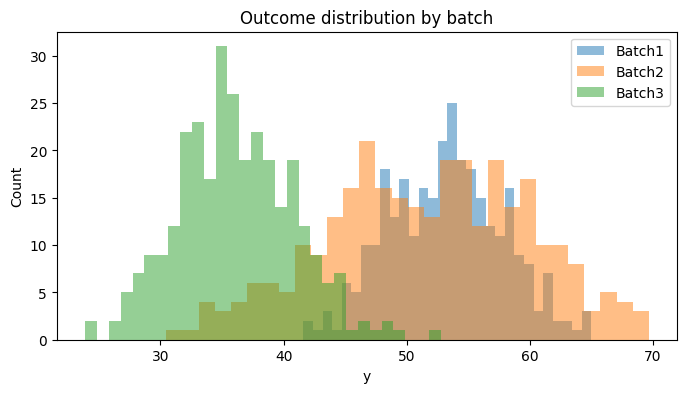
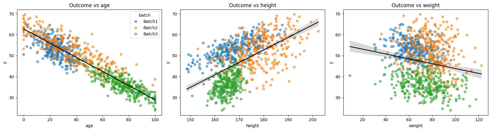
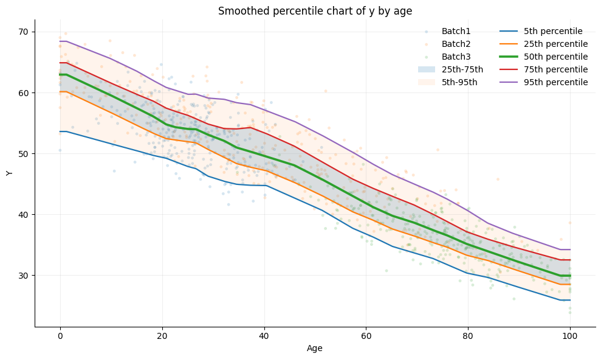
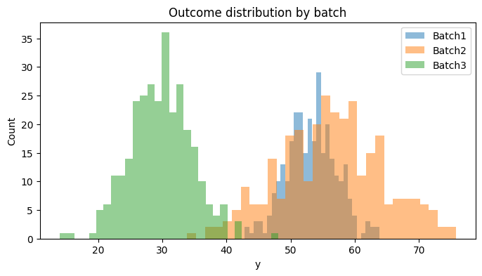
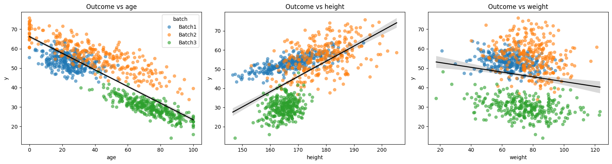
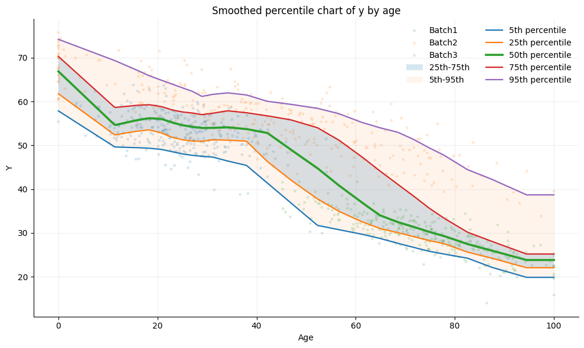

Section 1.4: Sample differences between scanners and sites
----------------------------------------------------------

**Modelling a single IDP**

Now we have established that image level differences will propogate into
even the most simple derived metrics, such as volume measurements, we
will look at how this may affect pooled, using *simulated* tabular
multi-site datasets.

In the most simple modelling approach, an individual measurement for one
individual (for example, hippocampal volume) for participant i at site j
can be expressed as a simple linear model of the form below:

.. math:: y_{ij} = \alpha_j + \epsilon_{ij}

Where:

.. math:: y_{ij} \text{ is the observed measurement}

.. math:: \alpha_j \text{ is the average value at site } j

.. math:: \epsilon_{ij} \text{ represents subject-level variation and noise}

This assumes that a single measurement, for example the volume, is just
a linear combination of the mean volume of that ROI, plus some subject
specific effect :math:`\epsilon_{ij}`

**Incorporating Biological Covariates**

However, we know that volumes will be affected by many other variables,
such as age, sex, height, weight or disease. As such, a better simulated
model will also include terms for these measures, and potentially
interactions between them (such as age :math:`\times` sex).

The most simple model, assuming no interactions, is then:

.. math:: y_{ij} = \alpha_j + X_i \beta_j + \epsilon_{ij}
    

Have a look at what this looks like below; Here we simulate three sites,
all drawn from the same normal distribution, and then choose site
specific population characteristics. These will share the same fixed
effects, but different distributions among sites.

Have a go at changing these characteristics below in the GUI and look at
the resulting histograms.

**As you work through the simulations, consider:**

-  Which variables are true biological effects?
-  Which variables might act as confounds?
-  What happens if site and biological variables become correlated?

.. code:: ipython3

    from block1_utils.SimulateDataBlock1 import make_simulator_input_gui
    import matplotlib.pyplot as plt 
    import pathlib
    _ = make_simulator_input_gui()

.. parsed-literal::

    VBox(children=(HTML(value='<h3>Simulator input builder</h3>'), HTML(value='<b>Global settings</b>'), GridBox(c…

.. code:: ipython3

    from block1_utils.SimulateDataBlock1 import simulate_batched_data
    
    data =[]
    params = make_simulator_input_gui.last_result
    data = params["data"]
    batch = params["batch"]
    covariate_specs = params["covariate_specs"]
    betas = params["betas"]
    batch_params = params["batch_params"]
    
    df = simulate_batched_data(
        data=data,
        batch=batch,
        covariate_specs=covariate_specs,
        betas=betas,
        noise_sd=1.0,
        seed=123,
    )
    df.head()
    
    plt.figure(figsize=(8, 4))
    for b in df["batch"].unique():
        plt.hist(df.loc[df["batch"] == b, "y"], bins=30, alpha=0.5, label=b)
    plt.legend()
    plt.title("Outcome distribution by batch")
    plt.xlabel("y")
    plt.ylabel("Count")
    plt.show()

.. code:: ipython3

    from block1_utils.PlottingBlock1 import plot_charts, plot_age_percentile_chart
    
    fig = plot_charts(df, ["age", "height", "weight"], batch_col="batch", outcome_col="y")
    
    # Also show the age nomogram:
    
    fig, ax = plot_age_percentile_chart(
        df,
        age_col="age",
        value_col="y",
        batch_col="batch",
        n_bins=25,
        smooth_frac=0.25,
        show_points=True,
        show_batch_coloring=True,
    )
    
    plt.show()

Section 1.5: Non-biological site differences
--------------------------------------------

So far, we have simulated biological variation without major
scanner-related distortions. We will now introduce explicit batch
effects into the dataset.

Batch effects can alter both:

-  The mean of a measurement distribution

-  The variance of the measurement distribution

A commonly used harmonisation framework (such as ComBat) models the data
using an expression similar to:

.. math::  y_{ij} = \alpha_j + X_i \beta_j + X_i \beta_{batch} + \delta_{batch,i} \times \epsilon_{ij}

.. math:: \alpha_j \text{ represents the baseline mean}

.. math:: X_i \beta_j \text{ captures biological covariate effects}

.. math:: X_i \beta_{batch} \text{ represents additive batch effects (} \gamma_{b,j} \text{ is often also used)}

.. math:: \delta_{batch} \text{ represents multiplicative variance effects}

.. math:: \epsilon_{ij} \text{ is residual error}

Batch effects can produce misleading conclusions if not properly
accounted for.

For example: A disease group may appear different simply because most
patients were scanned at one site or scanner differences may mask
genuine biological relationships.

As you explore the simulations, think carefully about:

-  Which effects are biological?

-  Which are scanner-related?

-  How difficult would it be to separate these effects in a real study?

.. code:: ipython3

    from block1_utils.SimulateDataBlock1 import simulate_batched_data
    
    # Add some batch effects to the data and see how they impact the distribution of the outcome variable. 
    # We will simulate data with 3 batches, each with different covariate distributions and batch effects.
    batch_params = {
        "Batch1": {"add_mean": 0.00, "add_sd": 0.05, "multi_mean": 1.00, "multi_shape": 25.0},
        "Batch2": {"add_mean": 5, "add_sd": 0.08, "multi_mean": 1.5, "multi_shape": 18.0},
        "Batch3": {"add_mean": -7, "add_sd": 0.06, "multi_mean": 0.8, "multi_shape": 30.0},
    }
    # Recreate the data this time with the batch effects:
    df2 = simulate_batched_data(
        data=data,
        batch=batch,
        covariate_specs=covariate_specs,
        betas=betas,
        batch_params=batch_params,
        noise_sd=1.0,
        relative_batch_effects=True,
        seed=42,
    )
    
    plt.figure(figsize=(8, 4))
    for b in df2["batch"].unique():
        plt.hist(df2.loc[df2["batch"] == b, "y"], bins=30, alpha=0.5, label=b)
    plt.legend()
    plt.title("Outcome distribution by batch")
    plt.xlabel("y")
    plt.ylabel("Count")
    plt.show()

After introducing batch effects, the relationships between imaging
measurements and explanatory variables become much harder to interpret.

In many cases:

-  Correlations weaken

-  Variability increases

-  Site-specific clusters emerge

-  Biological trends become obscured

This is one of the central challenges of multi-site neuroimaging. Even
relatively small scanner effects can distort normative trajectories,
bias machine learning models, reduce reproducibility and produce
spurious findings.

.. code:: ipython3

    from block1_utils.PlottingBlock1 import plot_charts
    fig = plot_charts(df2, ["age", "height", "weight"], batch_col="batch", outcome_col="y")
    
    fig, ax = plot_age_percentile_chart(
        df2,
        age_col="age",
        value_col="y",
        batch_col="batch",
        n_bins=25,
        smooth_frac=0.25,
        show_points=True,
        show_batch_coloring=True,
    )

Summary:
--------

*In this tutorial, we explored how scanner and site effects can
influence neuroimaging data at multiple levels, from raw image
appearance to derived quantitative measurements and downstream
statistical analyses. While multi-site studies are essential for
building large and representative datasets, they also introduce
technical variability that can obscure true biological effects if not
carefully accounted for. Understanding, identifying, and mitigating
these sources of variation is therefore a critical part of modern
neuroimaging research. As imaging datasets continue to grow in scale and
complexity, robust harmonisation strategies and thoughtful study design
will remain essential for ensuring reliable, reproducible, and
biologically meaningful results.*

Analysing batch effects in MRI data with DiagnoseHarmonise (DHARM)
==================================================================

Why this matters
----------------

In multi-site MRI studies, scanner and site effects can influence
neuroimaging data at several levels: raw image appearance, derived
quantitative measurements, and downstream statistical analyses.
Multi-site datasets are essential for building larger and more
representative studies, but they also introduce technical variation that
can obscure true biological effects if it is not properly addressed.

A good harmonisation workflow should therefore do more than apply a
correction method. It should first **diagnose** the batch effects that
are present, then assess whether harmonisation reduced those effects
while preserving meaningful biological signal. Comparing the data
**before and after harmonisation** is one of the most useful ways to
check that the method has worked as intended.

DiagnoseHarmonise (DHARM)
-------------------------

DiagnoseHarmonise (DHARM) is a Python library for the streamlined
application and assessment of harmonisation algorithms at the
summary-measure level. It provides structured diagnostic reports to help
users evaluate batch effects in MRI data and judge whether harmonisation
was needed, and whether it was successful. The project is available on
GitHub, and the documentation describes a command-line workflow as well
as a desktop GUI launcher for cross-sectional analyses.

You can install or explore the library via:

-  **PyPI** pip install DiagnoseHarmonise
-  **GitHub**

Take-home message
-----------------

As imaging datasets continue to grow in scale and complexity, robust
harmonisation strategies and thoughtful study design remain essential
for reliable, reproducible, and biologically meaningful results.

Citations:
==========

[1] Warrington, S., Torchi, A., Mougin, O. et al. A multi-site,
multi-modal travelling-heads resource for brain MRI harmonisation. Sci
Data 12, 609 (2025). https://doi.org/10.1038/s41597-025-04822-2

[2] M.W. Woolrich, S. Jbabdi, B. Patenaude, M. Chappell, S. Makni, T.
Behrens, C. Beckmann, M. Jenkinson, S.M. Smith. Bayesian analysis of
neuroimaging data in FSL. NeuroImage, 45:S173-86, 2009

[3] S.M. Smith, M. Jenkinson, M.W. Woolrich, C.F. Beckmann, T.E.J.
Behrens, H. Johansen-Berg, P.R. Bannister, M. De Luca, I. Drobnjak, D.E.
Flitney, R. Niazy, J. Saunders, J. Vickers, Y. Zhang, N. De Stefano,
J.M. Brady, and P.M. Matthews. Advances in functional and structural MR
image analysis and implementation as FSL. NeuroImage, 23(S1):208-19,
2004

[4] M. Jenkinson, C.F. Beckmann, T.E. Behrens, M.W. Woolrich, S.M.
Smith. FSL. NeuroImage, 62:782-90, 2012

[5] Bethlehem, R.A.I., Seidlitz, J., White, S.R. et al. Brain charts for
the human lifespan. Nature 604, 525–533 (2022).
https://doi.org/10.1038/s41586-022-04554-y
