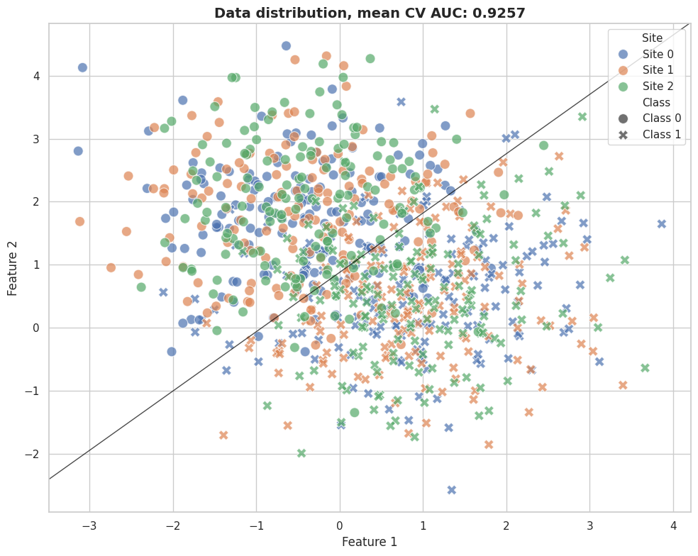
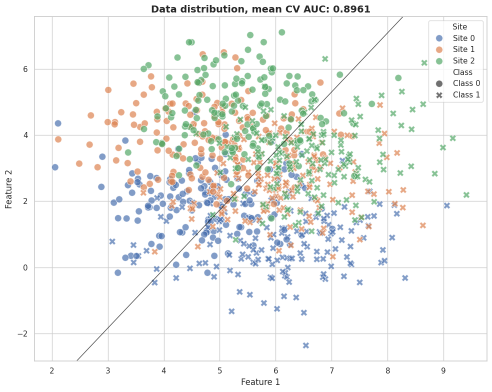
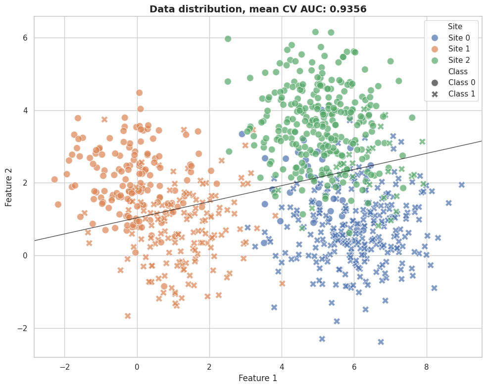
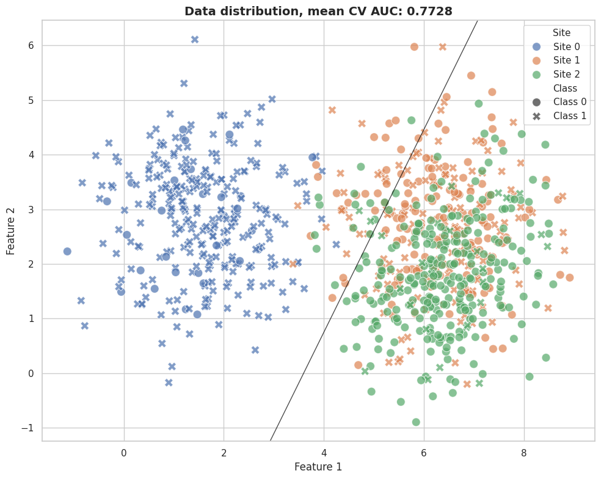
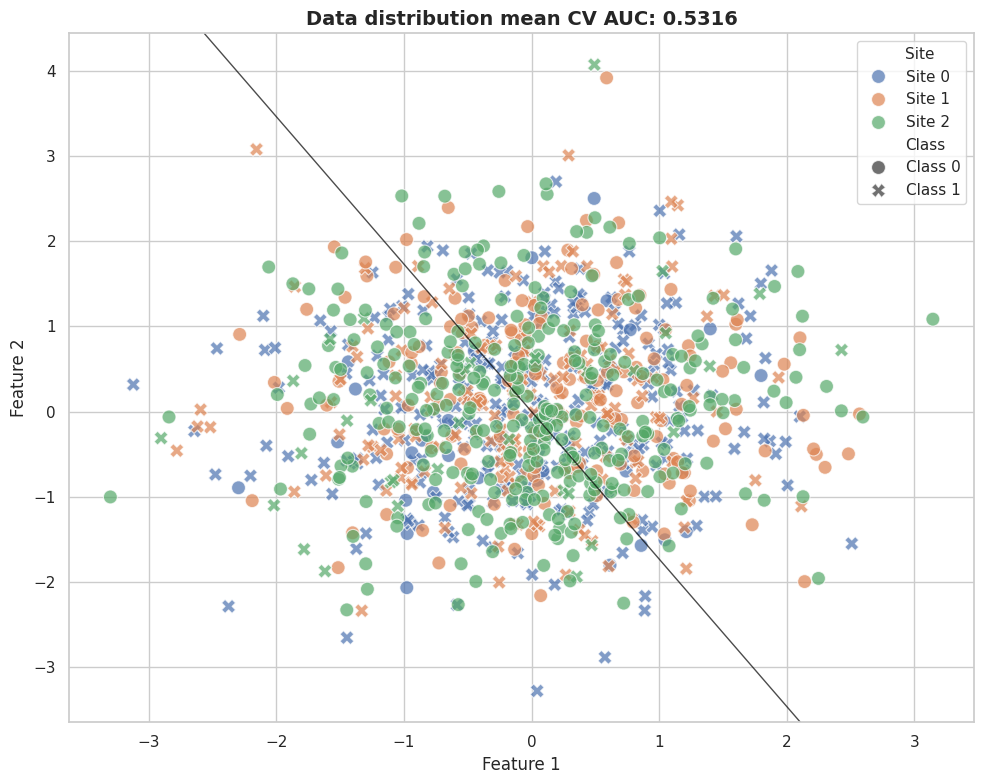

# Impact of *Effects of Site* in Machine Learning Pipelines
---------------------------------------------------------

The effects of site (EoS) can have two opposite effects on Machine
Learning (ML) pipelines.

-  They can **hinder** the real signal. In these cases, the ML models
   will have a harder time finding the true signal; thus, removing EoS
   should **improve** our classification, as the signal-to-noise ratio
   should improve.

-  They can **confound** the real signal. In these cases, the ML model
   can **use** the EoS signal to *fraudulently* improve the performance,
   as the predictions will not be based on a true biological signal but
   rather on site effects. In such cases, removing the EoS should
   *reduce* the model's performance. In general, this scenario happens
   when there is a class imbalance across sites, for example, because
   all (or the majority) of our patients came from one site and all (or
   the majority) of our controls came from another site.

In real-world scenarios, we will have a mix of both effects, which makes
the EoS particularly difficult to diagnose.

In these exercises, we will play with these 3 main factors, aiming to
showcase the impact of these factors in the ML pipelines:

-  Real signal strength.
-  Effect of site strength.
-  Class imbalance across sites.

.. code:: python

   # Imports
   import matplotlib.pyplot as plt
   import pandas as pd
   import seaborn as sns

   from sklearn.linear_model import LogisticRegression
   from sklearn.model_selection import StratifiedKFold, cross_val_score

   from uniharmony import verbosity
   from uniharmony.datasets import make_multisite_classification
   from uniharmony.plot import plot_decision_boundary_2d

   # Set uniharmony verbosity to warnings to avoid unnecessary messages.
   verbosity("warning")

   sns.set_theme(style="whitegrid")

   # For all our experiments, we will use LogisticRegression as classification model.
   clf = LogisticRegression()
   # For reproducibility
   random_state = 42
   # For all our experiments, we will use a Stratified K-fold with 10 folds.
   # The stratification makes all classes (target) equally represented in all our folds.
   cv = StratifiedKFold(n_splits=10, shuffle=True, random_state=random_state)

Section 1: Creating a Baseline
------------------------------

First, let's create an example without EoS and without class imbalance across sites.
~~~~~~~~~~~~~~~~~~~~~~~~~~~~~~~~~~~~~~~~~~~~~~~~~~~~~~~~~~~~~~~~~~~~~~~~~~~~~~~~~~

We will use this performance as a baseline to compare the rest of the
simulated scenarios.

Problem characteristic:
- Real signal: Yes 
- Effect of site: No 
- Class imbalance: No

.. code:: python

   # Data generation
   # ---------------
   X, y, sites = make_multisite_classification(
       n_samples=900,
       n_sites=3,
       n_features=2,
       signal_strength=2,
       site_effect_strength=0,
       balance_per_site=[[0.5, 0.5], [0.5, 0.5], [0.5, 0.5]],
       signal_type="blobs",
       random_state=random_state,
   )
   # Create DataFrame for easier plotting
   df = pd.DataFrame(
       {
           "Feature 1": X[:, 0],
           "Feature 2": X[:, 1],
           "Class": [f"Class {c}" for c in y],
           "Site": [f"Site {s}" for s in sites],
       }
   )
   # This is the ML step
   # Perform 10-fold stratified cross-validation
   scores = cross_val_score(clf, X, y, cv=cv, scoring="roc_auc")

   fig, ax = plt.subplots(1, 1, figsize=(10, 8))

   # Plot with site as hue and class as style
   sns.scatterplot(
       data=df,
       x="Feature 1",
       y="Feature 2",
       hue="Site",
       style="Class",
       s=100,
       alpha=0.7,
       ax=ax,
       hue_order=["Site 0", "Site 1", "Site 2"],
       style_order=["Class 0", "Class 1"],
   )
   ax.set_title(
       f"Data distribution, mean CV AUC: {scores.mean():.4f}",
       fontsize=14,
       fontweight="bold",
   )
   plt.tight_layout()

   # Fit the model and plot the decision boundary,
   # this is just for visualization purposes, the real evaluation was be done with cross-validation
   clf.fit(X, y)
   plot_decision_boundary_2d(ax, clf)

   output image 4-0

As no EoS is presented, the sites are indistinguishable from each other.
----------------------------------------------------------------------------

Section 2: Adding EoS.
----------------------

Now, let's add an EoS. For simplicity, let's add a simple location effect. Let's maintain our class balance across the site.
~~~~~~~~~~~~~~~~~~~~~~~~~~~~~~~~~~~~~~~~~~~~~~~~~~~~~~~~~~~~~~~~~~~~~~~~~~~~~~~~~~~~~~~~~~~~~~~~~~~~~~~~~~~~~~~~~~~~~~~~~~~~

Problem characteristic: - Real signal: Yes - Effect of site: Yes - Class
imbalance: No

What to expect?

-  On the features, we will expect that our sites will start being
   easier to separate, as each feature will be affected differently
   depending on the site.
-  On the ML performance, we will expect a drop in performance with
   respect to our baseline, as now the EoS are not confounded with the
   classes, as the classes are balanced. The EoS will act as noise.

.. code:: python

   X, y, sites = make_multisite_classification(
       n_samples=900,
       n_sites=3,
       n_features=2,
       signal_strength=2,
       site_effect_strength=7,
       balance_per_site=[[0.5, 0.5], [0.5, 0.5], [0.5, 0.5]],
       site_effect_type="location",
       site_effect_homogeneous=True,
       signal_type="blobs",
       random_state=random_state,
   )
   # Create DataFrame for easier plotting
   df = pd.DataFrame(
       {
           "Feature 1": X[:, 0],
           "Feature 2": X[:, 1],
           "Class": [f"Class {c}" for c in y],
           "Site": [f"Site {s}" for s in sites],
       }
   )
   # Perform 10-fold stratified cross-validation
   scores = cross_val_score(clf, X, y, cv=cv, scoring="roc_auc")

   fig, ax = plt.subplots(1, 1, figsize=(10, 8))
   # Plot with site as hue and class as style
   sns.scatterplot(
       data=df,
       x="Feature 1",
       y="Feature 2",
       hue="Site",
       style="Class",
       s=100,
       alpha=0.7,
       ax=ax,
       hue_order=["Site 0", "Site 1", "Site 2"],
       style_order=["Class 0", "Class 1"],
   )
   ax.set_title(
       f"Data distribution, mean CV AUC: {scores.mean():.4f}",
       fontsize=14,
       fontweight="bold",
   )

   plt.tight_layout()

   # Fit the model and plot the decision boundary,
   # this is just for visualization purposes, the real evaluation was be done with cross-validation
   clf.fit(X, y)
   plot_decision_boundary_2d(ax, clf)

   output image 9-0

Now the sites (colors) are easier to distinguish. Each feature is affected differently in each site.
~~~~~~~~~~~~~~~~~~~~~~~~~~~~~~~~~~~~~~~~~~~~~~~~~~~~~~~~~~~~~~~~~~~~~~~~~~~~~~~~~~~~~~~~~~~~~~~~~~~~

Exercise
~~~~~~~~

Change the value of the effect of site to check how the model behaves in more extreme cases.
--------------------------------------------------------------------------------------------

Section 3. Add site-class imbalance.
------------------------------------

Now, Let's change the class balance in our sites.
~~~~~~~~~~~~~~~~~~~~~~~~~~~~~~~~~~~~~~~~~~~~~~~~~

Problem characteristic: - Real signal: Yes - Effect of site: Yes - Class
imbalance: Yes

What to expect?

-  On the features, we will expect that our sites will start being
   easier to separate, as each feature will be affected differently
   depending on the site.
-  On the ML performance, we will expect a drop in performance with
   respect to our (baseline)

.. code:: python

   # Here, we can provide how is the imbalance of class 1 for each site.
   # In this case, only a 10% of class 1 will be presented in site 1, while 90% of samples will come for class 1 in site 3. Site 2 is still balanced.
   balance_per_site = [[0.1,  0.9], [0.5, 0.5], [0.9, 0.1]]

   X, y, sites = make_multisite_classification(
       n_samples=900,
       n_sites=3,
       n_features=2,
       signal_strength=2,
       site_effect_strength=7,
       balance_per_site=balance_per_site,
       signal_type="blobs",
       site_effect_type="location",
       random_state=random_state,
   )
   # Create DataFrame for easier plotting
   df = pd.DataFrame(
       {
           "Feature 1": X[:, 0],
           "Feature 2": X[:, 1],
           "Class": [f"Class {c}" for c in y],
           "Site": [f"Site {s}" for s in sites],
       }
   )
   # Perform 10-fold stratified cross-validation
   scores = cross_val_score(clf, X, y, cv=cv, scoring="roc_auc")

   fig, ax = plt.subplots(1, 1, figsize=(10, 8))
   # Plot with site as hue and class as style
   sns.scatterplot(
       data=df,
       x="Feature 1",
       y="Feature 2",
       hue="Site",
       style="Class",
       s=100,
       alpha=0.7,
       ax=ax,
       hue_order=["Site 0", "Site 1", "Site 2"],
       style_order=["Class 0", "Class 1"],
   )
   ax.set_title(
       f"Data distribution, mean CV AUC: {scores.mean():.4f}",
       fontsize=14,
       fontweight="bold",
   )

   plt.tight_layout()

   # Fit the model and plot the decision boundary,
   # this is just for visualization purposes, the real evaluation was be done with cross-validation
   clf.fit(X, y)
   plot_decision_boundary_2d(ax, clf)

   output image 15-0

Now, Site 0 (blue color) has more data from Class 0 (circles) (90%), as we set the amount of Class 1 to be 10%.
-------------------------------------------------------------------------------------------------------------------

Section 3: Removing Real signal
-------------------------------

Let's remove the real signal.
~~~~~~~~~~~~~~~~~~~~~~~~~~~~~

Problem characteristic: - Real signal: No - Effect of site: Yes - Class
imbalance: Yes

What to expect?

-  While our ML model should give a by-chance performance, as no real
   signal is presented, the ML model, we will pick the EoS as real
   signal, as now those are confounded.

.. code:: python

   balance_per_site = [[0.1,  0.9], [0.5, 0.5], [0.9, 0.1]]

   X, y, sites = make_multisite_classification(
       n_samples=900,
       n_sites=3,
       n_features=2,
       signal_strength=0.01,
       site_effect_strength=7,
       site_effect_type="location",
       signal_type="blobs",
       random_state=23,
       balance_per_site=balance_per_site,
   )
   # Create DataFrame for easier plotting
   df = pd.DataFrame(
       {
           "Feature 1": X[:, 0],
           "Feature 2": X[:, 1],
           "Class": [f"Class {c}" for c in y],
           "Site": [f"Site {s}" for s in sites],
       }
   )
   # Perform 10-fold stratified cross-validation
   scores = cross_val_score(clf, X, y, cv=cv, scoring="roc_auc")

   fig, ax = plt.subplots(1, 1, figsize=(10, 8))
   # Plot with site as hue and class as style
   sns.scatterplot(
       data=df,
       x="Feature 1",
       y="Feature 2",
       hue="Site",
       style="Class",
       s=100,
       alpha=0.7,
       ax=ax,
       hue_order=["Site 0", "Site 1", "Site 2"],
       style_order=["Class 0", "Class 1"],
   )
   ax.set_title(
       f"Data distribution, mean CV AUC: {scores.mean():.4f}",
       fontsize=14,
       fontweight="bold",
   )

   plt.tight_layout()

   # Fit the model and plot the decision boundary,
   # this is just for visualization purposes, the real evaluation was be done with cross-validation
   clf.fit(X, y)
   plot_decision_boundary_2d(ax, clf)

   output image 20-0

Even without any real signal, our model is obtaining a performance comparable to the baseline performance only using the EoS and the class imbalance!
-----------------------------------------------------------------------------------------------------------------------------------------------------------

Section 4: Removing real and EoS signal.
---------------------------------------

We now remove the real signal and the EoS signal. Even with class imbalance across sites, there is nothing to pick up.
~~~~~~~~~~~~~~~~~~~~~~~~~~~~~~~~~~~~~~~~~~~~~~~~~~~~~~~~~~~~~~~~~~~~~~~~~~~~~~~~~~~~~~~~~~~~~~~~~~~~~~~~~~~~~~~~~~~~~~

Problem characteristic: - Real signal: No - Effect of site: No - Class
imbalance: Yes

What to expect?

-  As no signal is presented (nor real nor EoS), the imbalance will not
   produce any effect in the classification performance.

.. code:: python

   balance_per_site = [[0.1,  0.9], [0.5, 0.5], [0.9, 0.1]]
   X, y, sites = make_multisite_classification(
       n_sites=3,
       n_features=2,
       signal_strength=0.01,
       site_effect_strength=0,
       signal_type="blobs",
       site_effect_homogeneous=False,
       balance_per_site=balance_per_site,
       random_state=random_state,
   )

   # Create DataFrame for easier plotting
   df = pd.DataFrame(
       {
           "Feature 1": X[:, 0],
           "Feature 2": X[:, 1],
           "Class": [f"Class {c}" for c in y],
           "Site": [f"Site {s}" for s in sites],
       }
   )
   scores = cross_val_score(clf, X, y, cv=cv, scoring="roc_auc")

   fig, ax = plt.subplots(1, 1, figsize=(10, 8))
   # Plot with site as hue and class as style
   sns.scatterplot(
       data=df,
       x="Feature 1",
       y="Feature 2",
       hue="Site",
       style="Class",
       s=100,
       alpha=0.7,
       ax=ax,
       hue_order=["Site 0", "Site 1", "Site 2"],
       style_order=["Class 0", "Class 1"],
   )

   ax.set_title(
       f"Data distribution mean CV AUC: {scores.mean():.4f}",
       fontsize=14,
       fontweight="bold",
   )
   plt.tight_layout()

   # Fit the model and plot the decision boundary,
   # this is just for visualization purposes, the real evaluation was be done with cross-validation
   clf.fit(X, y)
   plot_decision_boundary_2d(ax, clf)

   output image 25-0

Take-away message.
~~~~~~~~~~~~~~~~~~

-  EoS can have a different effect in our ML analysis. A good first step
   is to check how the class imbalance is across sites.
-  This example aims to showcase the basic possibilities. Real-world
   problems are much messier, with multiple sites, heterogeneous
   imbalances, more complex site-level effects, more features, and fewer
   subjects.

Question
~~~~~~~~

-  After harmonizing our data, how could we distinguish if the
   harmonization model removed only the EoS signal, or it has only
   removed the real signal confounded with the sites?

Solution
~~~~~~~~

You can check the solutions of this notebook
`here <https://github.com/N-Nieto/OHBM2026_Educational_course_harmonization/tree/main/solutions/block03>`__
