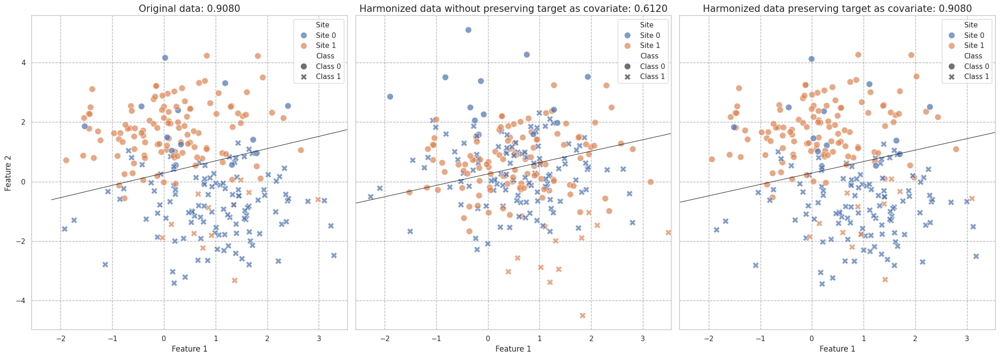

Location/Scale models on site-imbalance data.
=============================================

Site-imbalance scenarios occur when the classes have different
imbalances in each site. The extreme case of the scenario is when one site is
in charge of collecting all the patients and another site is in charge of
collecting the healthy controls.

In this case, the Effect of Site is correlated with the target of
Interest and ComBat will not be able to separate the EoS from the True
signal, unless we pass our target as a covariate. Even if we do not
have an EoS, the target variance will be confounded as EoS for the model
and it will try to remove it.

In this notebook, we will simulate this scenario and apply NeuroComBat
with and without preserving the target as a covariate, and see the effect
in a simple machine learning model.

.. code:: python

   # Imports
   import matplotlib.pyplot as plt
   import pandas as pd
   import seaborn as sns
   from uniharmony.datasets import make_multisite_classification
   from uniharmony.plot import plot_decision_boundary_2d
   from sklearn.linear_model import LogisticRegression
   from sklearn.model_selection import train_test_split
   from uniharmony import verbosity

   verbosity("error")

   from uniharmony.combat import NeuroComBat

   sns.set_theme(style="whitegrid")
   random_state = 23

Let's create an example where no EoS will be simulated, and only real signal will be presented.
~~~~~~~~~~~~~~~~~~~~~~~~~~~~~~~~~~~~~~~~~~~~~~~~~~~~~~~~~~~~~~~~~~~~~~~~~~~~~~~~~~~~~~~~~~~~~~~

To generate the site-target dependence, we will generate an imbalance
problem by site, making 10% of the data in Site 0 to belong to Class 1.

.. code:: python

   # Data generation
   X, y, sites = make_multisite_classification(
       n_features=2,
       signal_strength=2,
       site_effect_strength=0,
       balance_per_site=[[0.1, 0.9], [0.9, 0.1]],
       site_effect_homogeneous=True,
       site_effect_type="location",
       signal_type="blobs",
       random_state=random_state,
   )

   X_train, X_test, y_train, y_test, sites_train, sites_test = train_test_split(
       X, y, sites
   )

   clf = LogisticRegression(random_state=random_state)
   combat = NeuroComBat()

Now let's apply our the harmonization in these two Scenarios.
~~~~~~~~~~~~~~~~~~~~~~~~~~~~~~~~~~~~~~~~~~~~~~~~~~~~~~~~~~~~~

.. code:: python

   # Harmonization
   # Harmonizing without preserving the target as covariate
   X_harmonized_train = combat.fit_transform(X=X_train, sites=sites_train)
   X_harmonized = combat.transform(X_test, sites_test)

   # Preserve the target as covariate
   # This is the key line: we need to include the target variable as a covariate
   # to preserve the  features's signal during harmonization.
   X_harmonized_train_target = combat.fit_transform(
       X=X_train, sites=sites_train, categorical_covariates=y_train
   )

   #############################################################################################
   # This step generally represent *data leakage* in a ML learning pipeline
   # In most of the ML applications, the test target is unknown and is what we aim to predict.
   # We should not be able to give this information to the harmonization model.
   X_harmonized_target = combat.transform(
       X_test, sites_test, categorical_covariates=y_test
   )

   #############################################################################################

Now plot the results
^^^^^^^^^^^^^^^^^^^^

.. code:: python

   fontsize = 15
   ####### Prepare data for plotting.
   # Create DataFrame for easier plotting
   df = pd.DataFrame(
       {
           "Feature 1": X_test[:, 0],
           "Feature 2": X_test[:, 1],
           "Class": [f"Class {c}" for c in y_test],
           "Site": [f"Site {s}" for s in sites_test],
       }
   )

   # Create DataFrame for easier plotting
   df_harm = pd.DataFrame(
       {
           "Feature 1": X_harmonized[:, 0],
           "Feature 2": X_harmonized[:, 1],
           "Class": [f"Class {c}" for c in y_test],
           "Site": [f"Site {s}" for s in sites_test],
       }
   )

   # Create DataFrame for easier plotting
   df_harm_target = pd.DataFrame(
       {
           "Feature 1": X_harmonized_target[:, 0],
           "Feature 2": X_harmonized_target[:, 1],
           "Class": [f"Class {c}" for c in y_test],
           "Site": [f"Site {s}" for s in sites_test],
       }
   )

   fig, ax = plt.subplots(1, 3, figsize=(22, 8), sharex=True, sharey=True)
   # Plot with site as hue and class as style
   sns.scatterplot(
       data=df,
       x="Feature 1",
       y="Feature 2",
       hue="Site",
       style="Class",
       s=100,
       alpha=0.7,
       ax=ax[0],
       hue_order=["Site 0", "Site 1"],
       style_order=["Class 0", "Class 1"],
   )
   clf.fit(X_train, y_train)
   scores = clf.score(X_test, y_test)
   ax[0].set_title(f"Original data: {scores:.4f}", fontsize=fontsize)
   ax[0].grid(alpha=0.3, color="black", linestyle="--")
   plot_decision_boundary_2d(ax[0], clf)

   # Plot with site as hue and class as style
   sns.scatterplot(
       data=df_harm,
       x="Feature 1",
       y="Feature 2",
       hue="Site",
       style="Class",
       s=100,
       alpha=0.7,
       ax=ax[1],
       hue_order=["Site 0", "Site 1"],
       style_order=["Class 0", "Class 1"],
   )
   clf.fit(X_harmonized_train, y_train)
   scores = clf.score(X_harmonized, y_test)

   ax[1].set_title(f"Harmonized data without preserving target as covariate: {scores:.4f}", fontsize=fontsize)
   ax[1].grid(alpha=0.3, color="black", linestyle="--")

   plot_decision_boundary_2d(ax[1], clf)
   # Plot with site as hue and class as style
   sns.scatterplot(
       data=df_harm_target,
       x="Feature 1",
       y="Feature 2",
       hue="Site",
       style="Class",
       s=100,
       alpha=0.7,
       ax=ax[2],
       hue_order=["Site 0", "Site 1"],
       style_order=["Class 0", "Class 1"],
   )
   clf.fit(X_harmonized_train_target, y_train)
   scores = clf.score(X_harmonized_target, y_test)

   ax[2].set_title(f"Harmonized data preserving target as covariate: {scores:.4f}", fontsize=fontsize)
   ax[2].grid(alpha=0.3, color="black", linestyle="--")
   plot_decision_boundary_2d(ax[2], clf)

   plt.tight_layout()

   output image 9-0

Take-home message
~~~~~~~~~~~~~~~~~

Location/Scale methods, in this case, NeuroComBat, struggle to preserve
the target variance in class imbalance scenarios unless we preserve it
as a covariate.

An important clarification is that preserving the target as a covariate
may be suited for statistical analysis, but violates the assumptions of
ML scenarios.

Questions
=========

What do you think would happen if EoS were simulated?

Solution
~~~~~~~~

You can check the solutions of this notebook
`here <https://github.com/N-Nieto/OHBM2026_Educational_course_harmonization/tree/main/solutions/block03>`__

