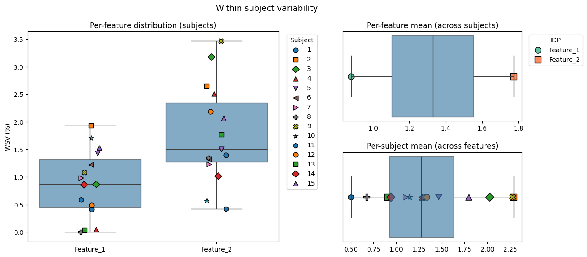
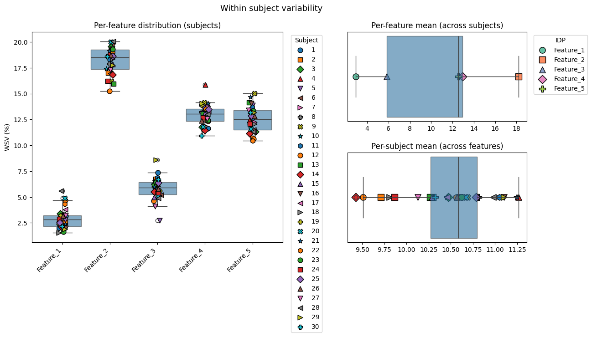
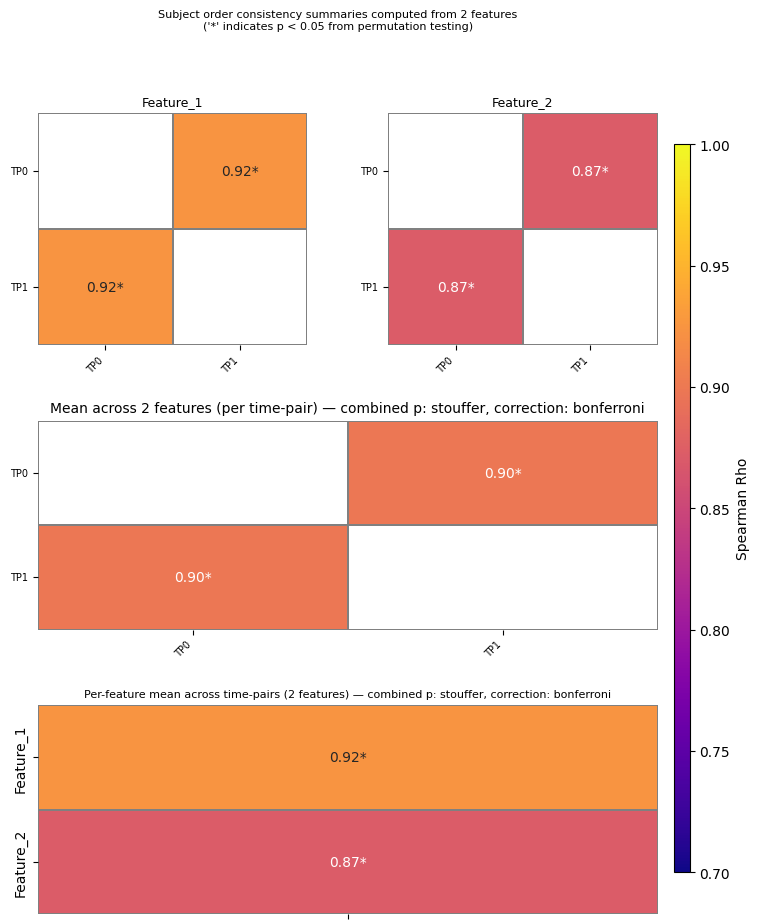
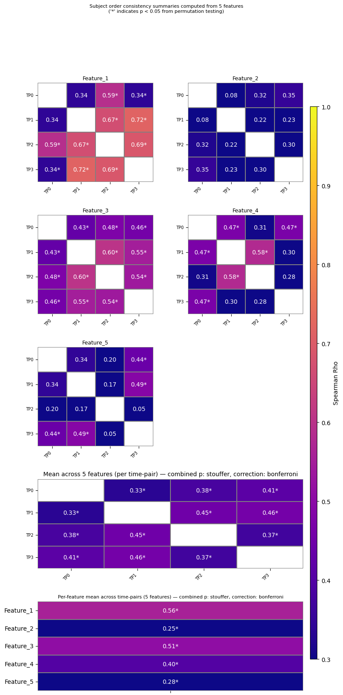
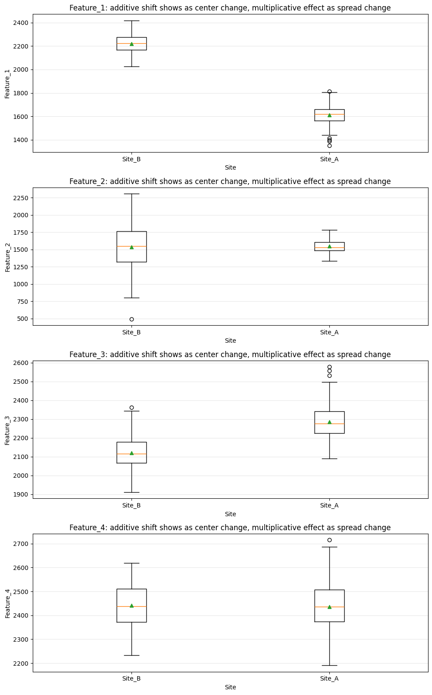

Harmonisation Evaluation Metrics
================================

In this section, we will explore several approaches for evaluating
harmonisation performance in longitudinal and multi-site imaging data.

--------------

Reliability-Based Metrics
-------------------------

We first examine:

- **Within-Subject Variability**
- **Subject Order Consistency**

These metrics are particularly useful for:

- test-retest datasets,
- traveling-subject datasets,
- or scenarios where little or no biological change is expected over
  time.

The goal is to evaluate the reliability and consistency of measurements
across scanners, sites, or repeated acquisitions.

Why this matters
~~~~~~~~~~~~~~~~

If no true biological change is expected, large differences between
repeated scans may indicate:

- scanner/site effects,
- measurement instability,
- or technical variability.

Reliable measurements are especially important in clinical and
longitudinal studies where subtle biological effects are being
investigated.

--------------

Batch-Effect Evaluation
-----------------------

We then evaluate:

- **Additive Batch Effects**
- **Multiplicative Batch Effects**

These analyses can be applied to both:

- test-retest datasets,
- and true longitudinal datasets with expected biological change.

What these tests assess
~~~~~~~~~~~~~~~~~~~~~~~

- **Additive effects** evaluate whether scanners/sites introduce
  systematic shifts in mean values.
- **Multiplicative effects** evaluate whether scanners/sites introduce
  scaling/variance differences.

These effects are important because many harmonisation methods,
including ComBat-like approaches, are specifically designed to estimate
and remove additive and multiplicative batch effects while preserving
biological signal.

Together, these metrics provide complementary information about: -
measurement reliability, - preservation of biological structure, - and
residual scanner/site-related bias after harmonisation.

Simulated Harmonisation Dataset Parameters
------------------------------------------

The simulated dataset is generated using:

.. code:: python

   df = simulate_harmonisation_data(
       n_subjects=n_subjects,
       n_timepoints=n_timepoints,
       n_features=n_features,
       seed=1,
       subject_mean=2000,
       subject_sd=80,
       noise_sd=20,
       scale=100
   )

Parameter Descriptions
~~~~~~~~~~~~~~~~~~~~~~

+------------------+--------------------------------------------------------+
| Parameter        | Description                                            |
+==================+========================================================+
| ``n_subjects``   | Number of simulated subjects/participants              |
+------------------+--------------------------------------------------------+
| ``n_timepoints`` | Number of repeated longitudinal measurements per       |
|                  | subject                                                |
+------------------+--------------------------------------------------------+
| ``n_features``   | Number of simulated imaging features/IDPs              |
+------------------+--------------------------------------------------------+
| ``seed``         | Random seed used for reproducibility                   |
+------------------+--------------------------------------------------------+
| ``subject_mean`` | Baseline magnitude of the simulated features           |
+------------------+--------------------------------------------------------+
| ``subject_sd``   | Biological variability between subjects                |
+------------------+--------------------------------------------------------+
| ``noise_sd``     | Random measurement noise added to each observation     |
+------------------+--------------------------------------------------------+
| ``scale_value``  | Magnitude of the simulated site/scanner batch effect   |
+------------------+--------------------------------------------------------+

Simulation Model
~~~~~~~~~~~~~~~~

Each observed feature value is generated as:

.. code:: text

   Observed value
   =
   True subject value
   + Site/batch effect
   + Random noise

where:

- ``subject_mean`` and ``subject_sd`` determine the underlying
  biological variation
- ``scale_value`` controls the strength of the site/scanner effect
- ``noise_sd`` controls random measurement variability

Site–Timepoint Confounding in the Simulation
~~~~~~~~~~~~~~~~~~~~~~~~~~~~~~~~~~~~~~~~~~~~

In the current simulation setup, each longitudinal timepoint is assigned
to a unique scanner/site. This creates a perfect confounding between
timepoint and site effects, such that:

.. code:: text

   TP0 → Site_A
   TP1 → Site_B
   TP2 → Site_C
   ...

As a result, all subjects scanned at a given timepoint are acquired on
the same site/scanner.

This simulates a realistic longitudinal harmonisation scenario in which
subjects are scanned repeatedly over time, but each visit occurs on a
different scanner or acquisition site. Consequently, observed
longitudinal differences may reflect both true biological change and
systematic scanner/site effects, motivating the need for harmonisation
methods.

1. Within-Subject Variability
-----------------------------

This function quantifies variability across repeated measurements within
the same subject.

For subjects with **2 measurements**, variability is computed as:

.. math::

   \mathrm{Variability}(\%) =
   \frac{|x_1 - x_2|}{\mathrm{mean}(x_1, x_2)} \times 100

For subjects with **more than 2 measurements**, the function computes
the **coefficient of variation (CoV)**:

.. math::

   \mathrm{CoV}(\%) =
   \frac{\mathrm{SD}(x)}{\mathrm{mean}(x)} \times 100

Lower values indicate better agreement across scans/sites/scanners.

.. code:: ipython3

    # Uncomment if packages are missing
    %pip install numpy pandas matplotlib statsmodels scikit-learn seaborn

.. code:: ipython3

    from block2_utils.HarmonisationEvaluation_functions import simulate_harmonisation_data
    
    # Let's simulate 30 subjects, acquired at 2 timepoints and has 2 features
    
    n_subjects=15
    n_timepoints=2 
    n_features=2
    seed=1
    subject_mean=2000
    subject_sd=80
    noise_sd=20
    scale_value=100
    
    df = simulate_harmonisation_data(
        n_subjects=n_subjects, 
        n_timepoints=n_timepoints, 
        n_features=n_features, 
        seed=seed,
        subject_mean=subject_mean, 
        subject_sd=subject_sd, 
        noise_sd=noise_sd,
        scale_value=scale_value
    )
    print(df.shape)
    print(df.head())

.. parsed-literal::

    (30, 5)
       Subject Timepoint    Site  Feature_1  Feature_2
    0        1       TP0  Site_A     2047.4     2872.1
    1        1       TP1  Site_B     2038.9     2832.2
    2        2       TP0  Site_A     1915.1     2961.4
    3        2       TP1  Site_B     1878.5     2883.9
    4        3       TP0  Site_A     1873.6     2923.9

.. code:: ipython3

    # Run code for calculating within-subject variability
    from block2_utils.HarmonisationEvaluation_functions import WithinSubjVar_long
    from block2_utils.HarmonisationEvaluation_plots import plot_WithinSubjVar
    
    # df has columns: Subject, Timepoint, Site, features
    
    features = [f"Feature_{i}" for i in range(1, n_features + 1)]
    
    idp_matrix = df[features].to_numpy()
    subjects = df["Subject"].to_list()
    timepoints = df["Timepoint"].to_list()
    
    # Get within subject variability
    result = WithinSubjVar_long(
        idp_matrix=idp_matrix,
        subjects=subjects,
        timepoints=timepoints,
        idp_names=features,
    )
    
    # Plot within subject variability
    plot_WithinSubjVar(
        result,
        subject_col="subject",
        limit_subjects=n_subjects,
        limit_idps_for_legend=n_features,
    )

.. parsed-literal::

    /Users/psyc1586_admin/OHBM2026_educational_harmonisation/latest/OHBM2026_Educational_course_harmonization/notebooks/block02/block2_utils/HarmonisationEvaluation_plots.py:97: UserWarning: set_ticklabels() should only be used with a fixed number of ticks, i.e. after set_ticks() or using a FixedLocator.
      axA.set_xticklabels(
    /Users/psyc1586_admin/OHBM2026_educational_harmonisation/latest/OHBM2026_Educational_course_harmonization/notebooks/block02/block2_utils/HarmonisationEvaluation_plots.py:177: UserWarning: This figure includes Axes that are not compatible with tight_layout, so results might be incorrect.
      plt.tight_layout(rect=[0, 0, 0.88, 0.95])

Interpretation of Results
~~~~~~~~~~~~~~~~~~~~~~~~~

The output shows the within-subject variability (%) for each subject.
What these plots are showing you -

- *Per-feature distribution*: For each feature (x-axis) and subject (see
  legend) we plot within-subject variability (%).
- *Per-feature mean*: For each feature (legend), we plot average WSV (%)
  across subjects.
- *Per-subject mean*: For each subject (legend), we plot average WSV (%)
  across features.

Because the simulated data represent repeated scans of the same
individuals with no expected biological change, differences mainly
reflect:

- scanner/site effects,
- measurement noise,
- technical variability.

Higher variability values indicate poorer agreement across repeated
measurements, while lower values indicate better consistency.

In the multi-timepoint example, the metric is computed using the
coefficient of variation (CoV), which summarizes variability across all
repeated scans for each subject.

For harmonisation evaluation:

- High within-subject variability before harmonisation suggests strong
  scanner/site effects.
- Reduced variability after harmonisation indicates improved consistency
  across scanners/sites.

--------------

Exercise: Extend the simulated data to multiple timepoints
~~~~~~~~~~~~~~~~~~~~~~~~~~~~~~~~~~~~~~~~~~~~~~~~~~~~~~~~~~

Modify the simulated dataset by increasing number of subjects,
timepoints, features etc. and run the code again.

1. Simulate a dataset with:

   - multiple subjects,
   - multiple timepoints,
   - multiple brain regions/features.

2. Run ``WithinSubjVar_long()`` using the simulated data.

3. Visualize the results using ``plot_WithinSubjVar()``.

4. Inspect:

   - within-subject variability values per feature,
   - within-subject variability values per subject/datapoint,
   - differences across features.

*Questions*
^^^^^^^^^^^

- Which features pairs show the highest variability?
- Which subjects show the lowest consistency?
- What happens to the within subject variability if scanner/site effects
  become larger?

Within-subject variability analysis from exercise
^^^^^^^^^^^^^^^^^^^^^^^^^^^^^^^^^^^^^^^^^^^^^^^^^

The within-subject variability analysis shows that the simulated
features exhibit different levels of longitudinal stability across
repeated measurements.

Overall:

- ``Feature_1`` showed the lowest variability across subjects (typically
  ~2–5%)
- ``Feature_3`` also demonstrated relatively low variability (~4–8%)
- ``Feature_4`` and ``Feature_5`` showed moderate variability (~11–15%)
- ``Feature_2`` consistently showed the highest within-subject
  variability (~15–20%)

These results suggest that some simulated features are substantially
more stable across longitudinal acquisitions, whereas others are more
sensitive to scanner/site effects and measurement noise.

The elevated variability observed for ``Feature_2`` may reflect stronger
simulated batch effects or increased noise contributions relative to the
other features.

.. code:: ipython3

    from block2_utils.HarmonisationEvaluation_functions import simulate_harmonisation_data
    from block2_utils.HarmonisationEvaluation_functions import WithinSubjVar_long
    from block2_utils.HarmonisationEvaluation_plots import plot_WithinSubjVar
    
    # Let's simulate 30 subjects, acquired at 4 timepoints and has 5 features
    n_subjects=30
    n_timepoints=4 
    n_features=5
    seed=1
    subject_mean=4000
    subject_sd=80
    noise_sd=80
    scale_value=500
    
    df = simulate_harmonisation_data(
        n_subjects=n_subjects, 
        n_timepoints=n_timepoints, 
        n_features=n_features, 
        seed=seed,
        subject_mean=subject_mean, 
        subject_sd=subject_sd, 
        noise_sd=noise_sd,
        scale_value=scale_value
    )
    print(df.shape)
    print(df.head())
    
    # Run code for calculating within-subject variability
    
    # df has columns: Subject, Timepoint, Site, BrainVolume
    features = [f"Feature_{i}" for i in range(1, n_features + 1)]
    idp_matrix = df[features].to_numpy()
    subjects = df["Subject"].to_list()
    timepoints = df["Timepoint"].to_list()
    
    # Get within subject variability
    result = WithinSubjVar_long(
        idp_matrix=idp_matrix,
        subjects=subjects,
        timepoints=timepoints,
        idp_names=features,
    )
    print(result)
    
    # Plot within subject variability
    plot_WithinSubjVar(
        result,
        subject_col="subject",
        limit_subjects=n_subjects,
        limit_idps_for_legend=n_features,
    )

.. parsed-literal::

    (120, 8)
       Subject Timepoint    Site  Feature_1  Feature_2  Feature_3  Feature_4  \
    0        1       TP0  Site_A     3923.1     3049.4     5161.3     5919.5   
    1        1       TP1  Site_B     4061.8     4233.0     4357.1     4909.0   
    2        1       TP2  Site_C     3769.6     3721.2     4604.3     4801.1   
    3        1       TP3  Site_D     3993.2     4732.9     4565.7     5963.7   
    4        2       TP0  Site_A     3888.8     3030.4     5272.0     5947.2   
    
       Feature_5  
    0     5222.2  
    1     4411.4  
    2     5236.8  
    3     4044.0  
    4     5211.4  
        subject  Feature_1  Feature_2  Feature_3  Feature_4  Feature_5
    0         1   3.177586  18.302832   7.357165  11.654049  12.636952
    1         2   2.568923  17.013698   6.762284  11.494846  10.701130
    2         3   3.410610  19.577738   6.276240  11.775657  11.331908
    3         4   2.903497  18.903159   6.263989  15.858414  12.407633
    4         5   2.791192  19.940948   2.745046  13.659523  13.870140
    5         6   3.163239  16.962862   5.198145  12.413692  11.480919
    6         7   2.160988  19.394360   5.501603  13.800011  12.261656
    7         8   3.348745  17.879815   6.001780  13.239904  13.590054
    8         9   2.469657  16.231706   5.600948  14.132722  15.002984
    9        10   3.159951  17.397587   6.524949  13.240563  11.954453
    10       11   2.008091  19.236810   6.880046  13.431652  13.706128
    11       12   4.698530  15.255618   4.634928  12.333584  10.620254
    12       13   2.092902  15.932737   6.118969  13.026190  14.152564
    13       14   2.146547  16.821529   5.526803  11.469320  11.160471
    14       15   2.181349  17.859348   4.970781  13.103948  13.324141
    15       16   1.990527  19.749763   6.345308  13.367954  14.052245
    16       17   3.797336  17.414897   6.492433  13.284981  11.295565
    17       18   1.570012  18.386749   5.154935  11.855295  12.067556
    18       19   3.210573  19.223758   5.585285  13.885312  12.085357
    19       20   4.892026  19.992492   5.059514  11.795861  11.595323
    20       21   2.370065  19.117004   6.019111  14.046286  14.666334
    21       22   4.341447  19.009182   5.448845  13.522046  10.467744
    22       23   1.646866  19.283006   6.430311  12.420152  13.331857
    23       24   2.893358  16.216801   5.423302  12.690093  12.093868
    24       25   2.537792  18.622657   6.386246  13.502839  12.877622
    25       26   3.166117  18.713689   5.782848  12.363542  12.819169
    26       27   3.231517  17.320806   4.117296  12.570999  13.393788
    27       28   5.599715  20.060490   4.878251  13.000600  11.339063
    28       29   1.916424  17.764063   8.589562  14.068814  13.174943
    29       30   2.180558  18.597533   6.717579  10.935154  13.180566

.. parsed-literal::

    /Users/psyc1586_admin/OHBM2026_educational_harmonisation/latest/OHBM2026_Educational_course_harmonization/notebooks/block02/block2_utils/HarmonisationEvaluation_plots.py:97: UserWarning: set_ticklabels() should only be used with a fixed number of ticks, i.e. after set_ticks() or using a FixedLocator.
      axA.set_xticklabels(
    /Users/psyc1586_admin/OHBM2026_educational_harmonisation/latest/OHBM2026_Educational_course_harmonization/notebooks/block02/block2_utils/HarmonisationEvaluation_plots.py:177: UserWarning: This figure includes Axes that are not compatible with tight_layout, so results might be incorrect.
      plt.tight_layout(rect=[0, 0, 0.88, 0.95])

--------------

2. Subject Order Consistency
----------------------------

This function evaluates how consistently subjects retain their relative
ordering across timepoints/scanners.

For each IDP, the function computes the **Spearman correlation** between
measurements from two timepoints:

- high correlation → subjects maintain a similar ranking across scans
- low correlation → subject ordering changes more across scans

A permutation test is used to compare the observed correlation against
correlations expected by chance.

- significant p-values indicate that the observed subject ordering is
  unlikely to occur randomly
- non-significant p-values suggest weaker or unstable ordering
  consistency

For harmonisation evaluation, strong and significant subject order
consistency suggests that biological differences between subjects are
preserved across scanners/timepoints.

.. code:: ipython3

    from block2_utils.HarmonisationEvaluation_functions import simulate_harmonisation_data
    from block2_utils.HarmonisationEvaluation_functions import SubjectOrder_long
    from block2_utils.HarmonisationEvaluation_plots import plot_SubjectOrder
    
    from block2_utils.HarmonisationEvaluation_functions import simulate_harmonisation_data
    
    # Let's simulate 15 subjects, acquired at 2 timepoints and has 2 features
    n_subjects=15
    n_timepoints=2 
    n_features=2
    seed=1
    subject_mean=2000
    subject_sd=80
    noise_sd=20
    scale_value=100
    
    df = simulate_harmonisation_data(
        n_subjects=n_subjects, 
        n_timepoints=n_timepoints, 
        n_features=n_features, 
        seed=seed,
        subject_mean=subject_mean, 
        subject_sd=subject_sd, 
        noise_sd=noise_sd,
        scale_value=scale_value
    )
    print(df.shape)
    print(df.head())
    
    # df has columns: Subject, Timepoint, Site, Features
    features = [f"Feature_{i}" for i in range(1, n_features + 1)]
    idp_matrix = df[features].to_numpy()
    subjects = df["Subject"].to_list()
    timepoints = df["Timepoint"].to_list()
    
    subjorder = SubjectOrder_long(
        idp_matrix=idp_matrix,
        subjects=subjects,
        timepoints=timepoints,
        idp_names=features,
        nPerm=100
    )
    print(subjorder)
    
    plot_SubjectOrder(subjorder, p_correction="bonferroni", cmap="plasma", cmap_limits=[0.7,1])

.. parsed-literal::

    (30, 5)
       Subject Timepoint    Site  Feature_1  Feature_2
    0        1       TP0  Site_A     2047.4     2872.1
    1        1       TP1  Site_B     2038.9     2832.2
    2        2       TP0  Site_A     1915.1     2961.4
    3        2       TP1  Site_B     1878.5     2883.9
    4        3       TP0  Site_A     1873.6     2923.9
      TimeA TimeB        IDP  nPairs  SpearmanRho  NullMeanRho    pValue
    0   TP0   TP1  Feature_1      15     0.925000     0.053964  0.009901
    1   TP0   TP1  Feature_2      15     0.871429    -0.025714  0.009901

.. parsed-literal::

    /Users/psyc1586_admin/OHBM2026_educational_harmonisation/latest/OHBM2026_Educational_course_harmonization/notebooks/block02/block2_utils/HarmonisationEvaluation_plots.py:382: RuntimeWarning: Mean of empty slice
      combined_rho_matrix = np.nanmean(stacked, axis=0)
    /Users/psyc1586_admin/OHBM2026_educational_harmonisation/latest/OHBM2026_Educational_course_harmonization/notebooks/block02/block2_utils/HarmonisationEvaluation_plots.py:466: RuntimeWarning: Mean of empty slice
      mean_rho_matrix = np.nanmean(stacked, axis=0)
    /Users/psyc1586_admin/OHBM2026_educational_harmonisation/latest/OHBM2026_Educational_course_harmonization/notebooks/block02/block2_utils/HarmonisationEvaluation_plots.py:608: UserWarning: This figure includes Axes that are not compatible with tight_layout, so results might be incorrect.
      plt.tight_layout(rect=[0, 0, 0.90, 0.96])

Exercise: Subject Order Consistency Across Timepoints
-----------------------------------------------------

In this exercise, we evaluate whether subjects retain a similar relative
ordering across repeated scans.

Tasks
~~~~~

1. Simulate a dataset with:

   - multiple subjects,
   - multiple timepoints,
   - multiple brain regions/features.

2. Run ``SubjectOrder_long()`` using the simulated data.

3. Visualize the results using ``plot_SubjectOrder()``.

4. Inspect:

   - Spearman correlation values,
   - permutation-test p-values,
   - differences across regions and timepoint pairs.

--------------

Overall Interpretation
~~~~~~~~~~~~~~~~~~~~~~

- High Spearman correlations indicate that subjects maintain a similar
  ranking across scans.
- Significant permutation-test p-values indicate that the observed
  consistency is stronger than expected by chance.
- Strong subject order consistency after harmonisation suggests that
  biological differences between subjects are preserved while
  scanner-related effects are reduced.

--------------

Questions
~~~~~~~~~

- Which timepoint pairs show the strongest consistency?
- Which regions show weaker consistency?
- What happens to the correlations if scanner/site effects become
  larger?
- Why is preserving subject ordering important in harmonisation?

Interpretation of the Subject-Order Consistency Results from exercise
^^^^^^^^^^^^^^^^^^^^^^^^^^^^^^^^^^^^^^^^^^^^^^^^^^^^^^^^^^^^^^^^^^^^^

The Spearman correlation analysis demonstrates varying levels of
subject-order consistency across longitudinal timepoint pairs and
simulated features.

Overall, the strongest consistency was observed for comparisons
involving later timepoints, particularly:

- **TP1–TP3**
- **TP2–TP3**
- **TP1–TP2**

For example:

- ``Feature_1`` showed very high correlations for:

  - TP1–TP3 (``ρ = 0.716``, ``p = 0.0099``)
  - TP2–TP3 (``ρ = 0.690``, ``p = 0.0099``)
  - TP1–TP2 (``ρ = 0.667``, ``p = 0.0099``)

Similarly, ``Feature_3`` and ``Feature_4`` demonstrated
moderate-to-strong consistency across several timepoint pairs, with many
statistically significant correlations.

In contrast, lower subject-order consistency was observed for:

- ``Feature_2``
- ``Feature_5``

particularly for:

- TP0–TP1
- TP1–TP2
- TP2–TP3

Examples include:

- ``Feature_5``, TP2–TP3 (``ρ = 0.051``, ``p = 0.772``)
- ``Feature_2``, TP0–TP1 (``ρ = 0.083``, ``p = 0.703``)

These low correlations suggest weaker preservation of subject ranking
across these timepoint pairs, potentially reflecting stronger simulated
site effects, measurement noise, or reduced feature stability.

Overall, the results illustrate that some features remain relatively
stable across longitudinal acquisitions despite scanner/site
differences, whereas others are substantially more sensitive to
simulated batch effects and noise.

.. code:: ipython3

    from block2_utils.HarmonisationEvaluation_functions import simulate_harmonisation_data
    from block2_utils.HarmonisationEvaluation_functions import SubjectOrder_long
    from block2_utils.HarmonisationEvaluation_plots import plot_SubjectOrder
    
    # Let's simulate 30 subjects, acquired at 4 timepoints and has 5 features
    n_subjects=30
    n_timepoints=4 
    n_features=5
    seed=1
    subject_mean=4000
    subject_sd=80
    noise_sd=80
    scale_value=500
    
    df = simulate_harmonisation_data(
        n_subjects=n_subjects, 
        n_timepoints=n_timepoints, 
        n_features=n_features, 
        seed=seed,
        subject_mean=subject_mean, 
        subject_sd=subject_sd, 
        noise_sd=noise_sd,
        scale_value=scale_value
    )
    print(df.shape)
    print(df.head())
    
    # df has columns: Subject, Timepoint, Site, Features
    features = [f"Feature_{i}" for i in range(1, n_features + 1)]
    idp_matrix = df[features].to_numpy()
    subjects = df["Subject"].to_list()
    timepoints = df["Timepoint"].to_list()
    
    subjorder = SubjectOrder_long(
        idp_matrix=idp_matrix,
        subjects=subjects,
        timepoints=timepoints,
        idp_names=features,
        nPerm=100
    )
    print(subjorder)
    
    plot_SubjectOrder(subjorder, p_correction="bonferroni", cmap="plasma", cmap_limits=[0.3,1])

.. parsed-literal::

    (120, 8)
       Subject Timepoint    Site  Feature_1  Feature_2  Feature_3  Feature_4  \
    0        1       TP0  Site_A     3923.1     3049.4     5161.3     5919.5   
    1        1       TP1  Site_B     4061.8     4233.0     4357.1     4909.0   
    2        1       TP2  Site_C     3769.6     3721.2     4604.3     4801.1   
    3        1       TP3  Site_D     3993.2     4732.9     4565.7     5963.7   
    4        2       TP0  Site_A     3888.8     3030.4     5272.0     5947.2   
    
       Feature_5  
    0     5222.2  
    1     4411.4  
    2     5236.8  
    3     4044.0  
    4     5211.4  
       TimeA TimeB        IDP  nPairs  SpearmanRho  NullMeanRho    pValue
    0    TP0   TP1  Feature_1      30     0.342825    -0.039889  0.089109
    1    TP0   TP1  Feature_2      30     0.082768    -0.024183  0.702970
    2    TP0   TP1  Feature_3      30     0.431115    -0.036537  0.029703
    3    TP0   TP1  Feature_4      30     0.471858     0.020418  0.019802
    4    TP0   TP1  Feature_5      30     0.344160    -0.006905  0.079208
    5    TP0   TP2  Feature_1      30     0.591991    -0.013143  0.009901
    6    TP0   TP2  Feature_2      30     0.319724    -0.023996  0.079208
    7    TP0   TP2  Feature_3      30     0.476349    -0.007991  0.019802
    8    TP0   TP2  Feature_4      30     0.306374    -0.008751  0.108911
    9    TP0   TP2  Feature_5      30     0.202670     0.033713  0.247525
    10   TP0   TP3  Feature_1      30     0.343715     0.000645  0.039604
    11   TP0   TP3  Feature_2      30     0.351318     0.023907  0.099010
    12   TP0   TP3  Feature_3      30     0.458268    -0.015642  0.029703
    13   TP0   TP3  Feature_4      30     0.468743     0.020868  0.009901
    14   TP0   TP3  Feature_5      30     0.441602     0.011778  0.019802
    15   TP1   TP2  Feature_1      30     0.666741    -0.027582  0.009901
    16   TP1   TP2  Feature_2      30     0.221802    -0.014429  0.198020
    17   TP1   TP2  Feature_3      30     0.603849    -0.021624  0.009901
    18   TP1   TP2  Feature_4      30     0.579820    -0.018623  0.009901
    19   TP1   TP2  Feature_5      30     0.166630     0.045286  0.396040
    20   TP1   TP3  Feature_1      30     0.715684    -0.019208  0.009901
    21   TP1   TP3  Feature_2      30     0.233370     0.013095  0.178218
    22   TP1   TP3  Feature_3      30     0.550612     0.003889  0.009901
    23   TP1   TP3  Feature_4      30     0.300556    -0.001179  0.148515
    24   TP1   TP3  Feature_5      30     0.488765    -0.015284  0.019802
    25   TP2   TP3  Feature_1      30     0.689878     0.008592  0.009901
    26   TP2   TP3  Feature_2      30     0.299666     0.016543  0.128713
    27   TP2   TP3  Feature_3      30     0.538436    -0.017728  0.009901
    28   TP2   TP3  Feature_4      30     0.275003    -0.008931  0.178218
    29   TP2   TP3  Feature_5      30     0.050945    -0.001499  0.772277

.. parsed-literal::

    /Users/psyc1586_admin/OHBM2026_educational_harmonisation/latest/OHBM2026_Educational_course_harmonization/notebooks/block02/block2_utils/HarmonisationEvaluation_plots.py:382: RuntimeWarning: Mean of empty slice
      combined_rho_matrix = np.nanmean(stacked, axis=0)
    /Users/psyc1586_admin/OHBM2026_educational_harmonisation/latest/OHBM2026_Educational_course_harmonization/notebooks/block02/block2_utils/HarmonisationEvaluation_plots.py:466: RuntimeWarning: Mean of empty slice
      mean_rho_matrix = np.nanmean(stacked, axis=0)
    /Users/psyc1586_admin/OHBM2026_educational_harmonisation/latest/OHBM2026_Educational_course_harmonization/notebooks/block02/block2_utils/HarmonisationEvaluation_plots.py:608: UserWarning: This figure includes Axes that are not compatible with tight_layout, so results might be incorrect.
      plt.tight_layout(rect=[0, 0, 0.90, 0.96])

--------------

3. Additive Batch Effect
------------------------

This test asks whether the scanner/site (``batch``) adds a systematic
shift to the measurements after accounting for covariates and
subject-level random effects.

A simplified model is:

.. math::

   y_{ij} = \beta_0 + \beta^T X_{ij} + \alpha_{b(i)} + u_i + \varepsilon_{ij}

where:

- :math:`y_{ij}` = measurement for subject :math:`i` at observation
  :math:`j`
- :math:`X_{ij}` = fixed effects / covariates
- :math:`\alpha_{b(i)}` = additive batch/site effect
- :math:`u_i` = subject-specific random effect
- :math:`\varepsilon_{ij}` = residual error

The function compares:

.. math::

   \text{Full model: } y \sim X + \text{batch} + (1 | \text{subject})

vs.

.. math::

   \text{Reduced model: } y \sim X + (1 | \text{subject})

A significant p-value suggests that the batch/site term explains
additional variation, indicating an **additive batch effect**.

For harmonisation, this is the kind of shift that methods like ComBat
are designed to remove.

--------------

4. Multiplicative Batch Effect
------------------------------

This test asks whether the variance differs across batches/sites after
accounting for covariates and subject-level random effects.

A simplified model is:

.. math::

   y_{ij} = \beta_0 + \beta^T X_{ij} + \alpha_{b(i)} + u_i + \varepsilon_{ij}

The key difference is that the residual spread is compared across batch
groups.

After fitting the mixed model, the residuals are tested with a variance
test:

.. math::

   H_0: \sigma^2_1 = \sigma^2_2 = \cdots = \sigma^2_K

vs.

.. math::

   H_1: \text{at least one batch has different variance}

The function uses the **Fligner-Killeen test** on model residuals
grouped by batch.

A significant p-value suggests a **multiplicative batch effect**,
meaning one site/scanner has more or less variability than another.

For harmonisation, this corresponds to a scale/variance difference
rather than a mean shift.

Interpretation
--------------

- **Additive effect significant**: batches differ in mean level.
- **Multiplicative effect significant**: batches differ in variance.
- **Both significant**: scanner/site influences both location and
  spread.

In a longitudinal harmonisation setting, successful correction should
reduce both effects while preserving subject-level structure and true
biological change.

--------------

Simulating longitudinal data with additive and multiplicative batch effects
---------------------------------------------------------------------------

This simulation generates synthetic longitudinal imaging data with:

- subject-specific biological variability
- longitudinal change over time
- age effects
- site/scanner batch effects
- random measurement noise

Unlike the previous simulation, site and timepoint are **not perfectly
confounded**. Each subject can be scanned at different sites across
timepoints:

.. code:: python

   subject_sites = np.random.choice(sites, size=n_timepoints, replace=True)

This creates a another realistic harmonisation scenario.

The simulated observed value is approximately:

.. code:: text

   Observed value
   =
   True biological signal
   + Additive site effect
   + Measurement noise

where:

- ``additive_shift`` introduces site-specific offsets
- ``multiplicative_scale`` changes the amount of site-specific noise
- ``slope_sd`` controls longitudinal subject trajectories
- ``noise_sd`` controls random measurement variability

This simulation is useful for studying how additive and multiplicative
scanner/site effects influence longitudinal analyses and harmonisation
methods.

.. code:: ipython3

    from block2_utils.HarmonisationEvaluation_functions import simulate_longitudinal_batch_data_mixed
    from block2_utils.HarmonisationEvaluation_plots import plot_additive_multiplicative_effects
    
    # Let's simulate some data: 100 subjects, 3 timepoints, 2 sites, features from 4 brain regions
    n_subjects=100
    n_timepoints=3
    n_sites=2
    n_features=4
    additive_shift = {"Site_B": {"Feature_1": 600, "Feature_3": -150}}
    multiplicative_scale = {"Site_B": {"Feature_2": 15.0}, "Site_A": {"Feature_4": 2.7}}
    
    df = simulate_longitudinal_batch_data_mixed(
        n_subjects=n_subjects,
        n_timepoints=n_timepoints,
        n_sites=n_sites,
        n_features=n_features,
        additive_shift=additive_shift,
        multiplicative_scale=multiplicative_scale,
        seed=1,
    )
    
    print(df.head(10))
    feature_cols = [f"Feature_{i}" for i in range(1, n_features + 1)]
    
    # Let's visualise additive and multiplicative effects
    plot_additive_multiplicative_effects(df, feature_cols=feature_cols, batch_col="Site")

.. parsed-literal::

       Subject Timepoint    Site   Age  Feature_1  Feature_2  Feature_3  Feature_4
    0        1       TP0  Site_B  78.0     2180.5      889.5     2362.7     2381.3
    1        1       TP1  Site_A  78.0     1553.1     1432.5     2487.1     2300.5
    2        1       TP2  Site_A  78.0     1533.2     1459.7     2497.8     2438.0
    3        2       TP0  Site_A  60.1     1660.3     1607.4     2150.7     2492.0
    4        2       TP1  Site_B  60.1     2284.2     2084.6     1978.2     2424.2
    5        2       TP2  Site_A  60.1     1700.5     1658.8     2159.9     2546.7
    6        3       TP0  Site_A  60.8     1634.4     1476.3     2191.8     2337.9
    7        3       TP1  Site_A  60.8     1626.8     1512.9     2169.2     2451.1
    8        3       TP2  Site_A  60.8     1634.4     1512.3     2220.3     2416.5
    9        4       TP0  Site_A  56.4     1629.5     1742.7     2199.9     2451.6

.. code:: ipython3

    from block2_utils.HarmonisationEvaluation_functions import AdditiveEffect_long
    from block2_utils.HarmonisationEvaluation_functions import MultiplicativeEffect_long
    import warnings
    
    feature_cols = [f"Feature_{i}" for i in range(1, n_features + 1)]
    
    # let's estimate additive and multiplicative batch effects
    additive_results, model_defs_add = AdditiveEffect_long(
        data=df,
        idp_names=feature_cols,
        idvar="Subject",
        batchvar="Site",
        timevar="Timepoint",
        fix_eff=["Age"],
        ran_eff=["Subject"],
        do_zscore=True,
        verbose=False,
    )
    print(additive_results)
    
    multiplicative_results, model_defs_mul = MultiplicativeEffect_long(
        data=df,
        idp_names=feature_cols,
        idvar="Subject",
        batchvar="Site",
        timevar="Timepoint",
        fix_eff=["Age"],
        ran_eff=["Subject"],
        do_zscore=True,
        verbose=False,
    )
    print(multiplicative_results)

.. parsed-literal::

    /Users/psyc1586_admin/OHBM2026_educational_harmonisation/latest/OHBM2026_Educational_course_harmonization/.venv/lib/python3.12/site-packages/statsmodels/regression/mixed_linear_model.py:1634: UserWarning: Random effects covariance is singular
      warnings.warn(msg)
    /Users/psyc1586_admin/OHBM2026_educational_harmonisation/latest/OHBM2026_Educational_course_harmonization/.venv/lib/python3.12/site-packages/statsmodels/regression/mixed_linear_model.py:2237: ConvergenceWarning: The MLE may be on the boundary of the parameter space.
      warnings.warn(msg, ConvergenceWarning)
    /Users/psyc1586_admin/OHBM2026_educational_harmonisation/latest/OHBM2026_Educational_course_harmonization/.venv/lib/python3.12/site-packages/statsmodels/regression/mixed_linear_model.py:1634: UserWarning: Random effects covariance is singular
      warnings.warn(msg)
    /Users/psyc1586_admin/OHBM2026_educational_harmonisation/latest/OHBM2026_Educational_course_harmonization/.venv/lib/python3.12/site-packages/statsmodels/regression/mixed_linear_model.py:1634: UserWarning: Random effects covariance is singular
      warnings.warn(msg)

.. parsed-literal::

         Feature      TestStat  df   p-value method
    0  Feature_1  42809.429774   1  0.000000   Wald
    1  Feature_3   3243.301501   1  0.000000   Wald
    2  Feature_4      0.140928   1  0.707360   Wald
    3  Feature_2      0.072801   1  0.787301   Wald

.. parsed-literal::

    /Users/psyc1586_admin/OHBM2026_educational_harmonisation/latest/OHBM2026_Educational_course_harmonization/.venv/lib/python3.12/site-packages/statsmodels/regression/mixed_linear_model.py:1634: UserWarning: Random effects covariance is singular
      warnings.warn(msg)

.. parsed-literal::

         Feature      ChiSq  DF       p-value   method
    0  Feature_2  93.614470   1  3.833746e-22  Fligner
    1  Feature_4  28.095495   1  1.154743e-07  Fligner
    2  Feature_3   0.018010   1  8.932425e-01  Fligner
    3  Feature_1   0.013899   1  9.061513e-01  Fligner

Interpreting results from additive and multiplicative effect analysis
~~~~~~~~~~~~~~~~~~~~~~~~~~~~~~~~~~~~~~~~~~~~~~~~~~~~~~~~~~~~~~~~~~~~~

The additive batch effect analysis identified significant site-related
mean shifts for:

- ``Feature_1``
- ``Feature_3``

both showing extremely small p-values (``p < 0.001``), indicating strong
additive scanner/site effects.

In contrast:

- ``Feature_2``
- ``Feature_4``

did not show significant additive batch effects, suggesting that their
mean feature values were relatively consistent across sites.

The multiplicative batch effect analysis (Fligner test) demonstrated
significant differences in variance across sites for:

- ``Feature_2``
- ``Feature_4``

indicating the presence of multiplicative batch effects or site-specific
changes in measurement variability.

Conversely:

- ``Feature_1``
- ``Feature_3``

did not exhibit significant multiplicative effects, suggesting more
stable variance across sites.

Overall, these results demonstrate that different simulated features can
be affected by different types of scanner/site bias:

- some primarily through shifts in mean values (additive effects)
- others through changes in variability (multiplicative effects)

--------------

Further Reading
---------------

For additional methodological details, implementation examples, and
extended discussions of harmonisation evaluation approaches, see:

- | **Paper:**
  | `Harmonising Structural Brain MRI from Multiple Sites with Limited
    Sample Sizes <https://doi.org/10.64898/2026.04.21.26351106>`__

- | **Tool/Repository:**
  | `More evaluation
    metrics <https://jake-turnbull.github.io/HarmonisationDiagnostics/>`__
