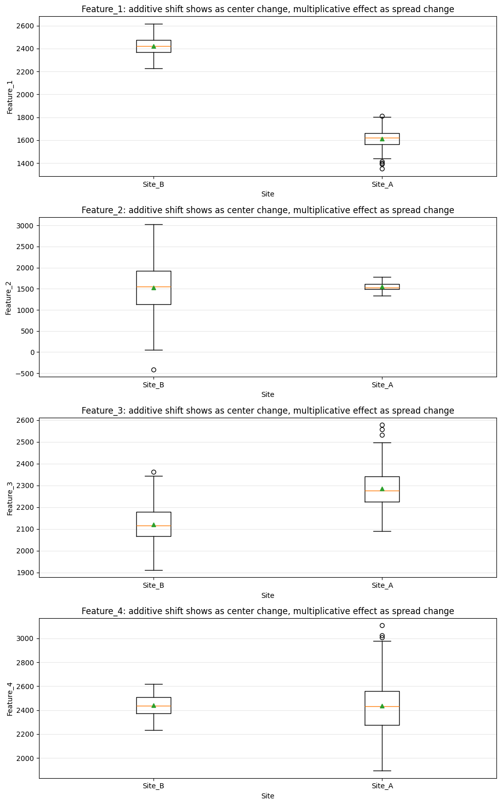
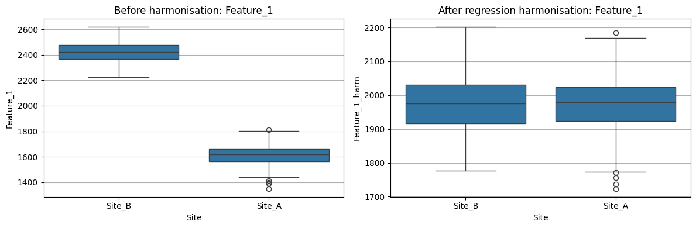
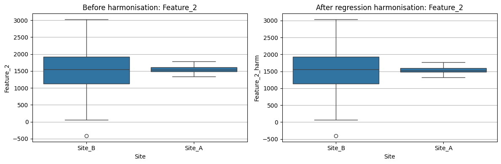
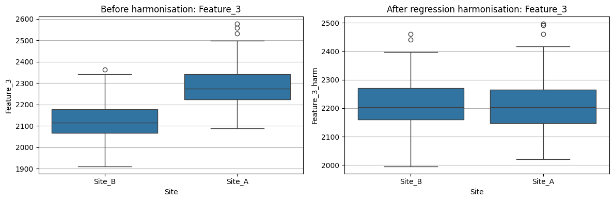
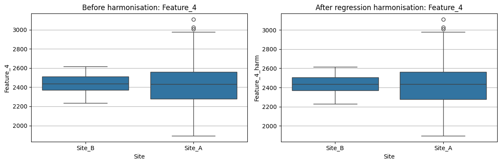
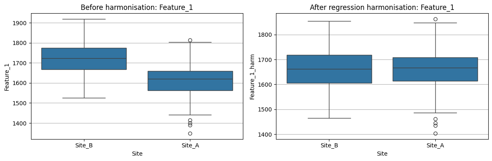
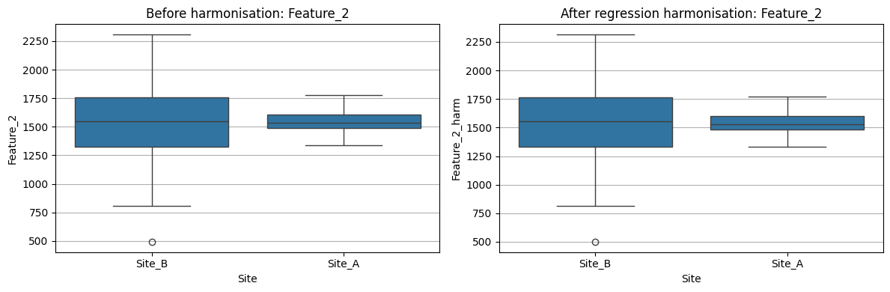
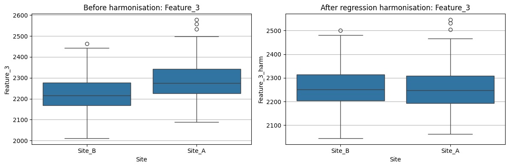
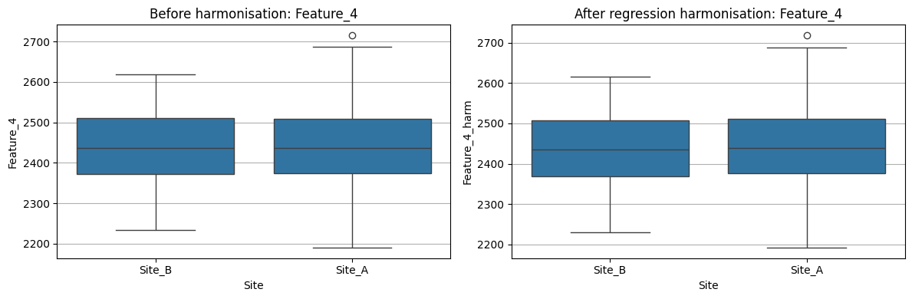

Regression-Based Harmonisation
===============================

As a simple baseline, we can use regression to remove site-related mean
shifts from the data.

For each feature, we fit a model like:

.. math::

   y = \beta_0 + \beta_1 \text{Age} + \beta_2 \text{Timepoint} + \gamma \text{Site} + \epsilon

Here:

- the **site term** captures additive scanner/batch effects,
- age and timepoint are kept as biological covariates,
- the residual part represents variation not explained by site.

Regression-Based Harmonisation Workflow
=======================================

In this section, we will use a simple regression-based approach to
reduce site-related variability in the simulated data.

The goal is to demonstrate:

- what regression-based harmonisation can correct,
- why more advanced methods such as ComBat-like approaches may still be needed.

--------------

Steps
-----

1. Simulate longitudinal multi-site data
~~~~~~~~~~~~~~~~~~~~~~~~~~~~~~~~~~~~~~~~

We first generate synthetic imaging data containing:

- repeated measurements,
- biological variation,
- covariate effects (e.g., Age),
- additive site effects,
- multiplicative site effects.

This creates a realistic harmonisation scenario where scanner/site
effects are intentionally introduced.

--------------

2. Visualize site-related effects
~~~~~~~~~~~~~~~~~~~~~~~~~~~~~~~~~

Before harmonisation, we inspect the distributions across sites using
boxplots.

This helps identify:

- additive effects -> shifts in mean values,
- multiplicative effects -> differences in spread/variance.

--------------

3. Apply regression-based harmonisation
~~~~~~~~~~~~~~~~~~~~~~~~~~~~~~~~~~~~~~~

We fit regression models that include:

- biological covariates,
- timepoint information,
- site/scanner terms.

The estimated site effects are then removed from the data.

This approach primarily targets additive batch effects.

--------------

4. Visualize the harmonized data
~~~~~~~~~~~~~~~~~~~~~~~~~~~~~~~~

We compare the distributions before and after correction to assess:

- reduction in site-related mean shifts,
- preservation of biological variability,
- remaining variance differences.

--------------

5. Evaluate remaining batch effects
~~~~~~~~~~~~~~~~~~~~~~~~~~~~~~~~~~~

Finally, we re-run:

- additive effect tests,
- multiplicative effect tests,
- reliability metrics.

This allows us to evaluate how much scanner/site variability remains
after harmonisation.

--------------

Key Concept
-----------

Regression-based harmonisation is useful for correcting systematic mean
shifts across sites.

However, if scanners also differ in variability or scale, regression
alone may not be sufficient.

This motivates the use of ComBat-like harmonisation methods, which aim
to model and remove both:

- additive effects,
- multiplicative effects.

.. code:: ipython3

    # Simulate 100 subjects, 3 timepoints, 2 sites, 4 features
    n_subjects = 100
    n_timepoints = 3
    n_sites = 2
    n_features = 4
    additive_shift = {"Site_B": {"Feature_1": 800, "Feature_3": -150}}
    multiplicative_scale = {"Site_B": {"Feature_2": 30.0}, "Site_A": {"Feature_4": 10}}

    df = simulate_longitudinal_batch_data_mixed(
        n_subjects=n_subjects,
        n_timepoints=n_timepoints,
        n_sites=n_sites,
        n_features=n_features,
        additive_shift=additive_shift,
        multiplicative_scale=multiplicative_scale,
        seed=1,
    )

    print(df.head(10))
    feature_cols = [f"Feature_{i}" for i in range(1, n_features + 1)]

    # Visualise additive and multiplicative effects
    plot_additive_multiplicative_effects(df, feature_cols=feature_cols, batch_col="Site")

.. parsed-literal::

       Subject Timepoint    Site   Age  Feature_1  Feature_2  Feature_3  Feature_4
    0        1       TP0  Site_B  78.0     2380.5      311.5     2362.7     2381.3
    1        1       TP1  Site_A  78.0     1553.1     1432.5     2487.1     2139.8
    2        1       TP2  Site_A  78.0     1533.2     1459.7     2497.8     2631.7
    3        2       TP0  Site_A  60.1     1660.3     1607.4     2150.7     2665.7
    4        2       TP1  Site_B  60.1     2484.2     2538.6     1978.2     2424.2
    5        2       TP2  Site_A  60.1     1700.5     1658.8     2159.9     2834.3
    6        3       TP0  Site_A  60.8     1634.4     1476.3     2191.8     2028.4
    7        3       TP1  Site_A  60.8     1626.8     1512.9     2169.2     2479.2
    8        3       TP2  Site_A  60.8     1634.4     1512.3     2220.3     2382.6
    9        4       TP0  Site_A  56.4     1629.5     1742.7     2199.9     2286.1

.. code:: ipython3

    feature_cols = [f"Feature_{i}" for i in range(1, n_features + 1)]

    df_harm, model_summary = regression_harmonize_site(
        df, feature_cols=feature_cols, site_col="Site", covariates=("Age", "Timepoint")
    )

.. parsed-literal::

    ================================================================================
    Model Summary
    ================================================================================
         Feature                                   Formula    Site_pvalue      0  Feature_1  Feature_1 ~ Age + C(Timepoint) + C(Site)  1.632206e-212       1  Feature_2  Feature_2 ~ Age + C(Timepoint) + C(Site)   7.166434e-01       2  Feature_3  Feature_3 ~ Age + C(Timepoint) + C(Site)   6.696867e-42       3  Feature_4  Feature_4 ~ Age + C(Timepoint) + C(Site)   7.744116e-01   
             R2
    0  0.962826
    1  0.027210
    2  0.477192
    3  0.012216
    ================================================================================
       Subject Timepoint    Site   Age  Feature_1  Feature_2  Feature_3      0        1       TP0  Site_B  78.0     2380.5      311.5     2362.7       1        1       TP1  Site_A  78.0     1553.1     1432.5     2487.1       2        1       TP2  Site_A  78.0     1533.2     1459.7     2497.8       3        2       TP0  Site_A  60.1     1660.3     1607.4     2150.7       4        2       TP1  Site_B  60.1     2484.2     2538.6     1978.2   
       Feature_4  Feature_1_harm  Feature_2_harm  Feature_3_harm  Feature_4_harm
    0     2381.3     1897.147971      322.295887     2461.000645     2377.844763
    1     2139.8     1903.689755     1424.669419     2415.799587     2142.306187
    2     2631.7     1932.368888     1450.784382     2416.619914     2634.553455
    3     2665.7     1994.690326     1599.931240     2082.694110     2668.090386
    4     2424.2     2033.227675     2548.672671     2069.915495     2420.976229
    ================================================================================

Interpreting the Regression Output
----------------------------------

The regression summary table provides feature-wise information about the
relationship between the imaging measurements and site effects.

Typical columns include:

- **Feature**
  The imaging feature/region being analysed.

- **Formula**
  The regression model used for harmonisation.

- **Site_pvalue**
  Statistical significance of the site/scanner term.

  - small p-values suggest strong site-related mean shifts
  - non-significant values suggest weaker additive batch effects

- **R2**
  Proportion of variance explained by the regression model.

Higher values indicate that the model explains a larger portion of
variability in the feature.

Expected observations
~~~~~~~~~~~~~~~~~~~~~

Before harmonisation:

- regions with simulated additive effects should often show significant site terms.

After regression-based harmonisation:

- site-related mean differences should reduce,
- visual separation across sites should become smaller.

However, variance differences may still remain for regions with
multiplicative batch effects.

Exercise: Regression-Based Harmonisation
----------------------------------------

In this exercise, simulate longitudinal multi-site imaging data
containing:

- additive batch effects,
- multiplicative batch effects,
- biological covariates (e.g., Age).

Then:

1. Visualize the site-related effects before harmonisation.
2. Apply regression-based harmonisation.
3. Visualize the harmonized data.
4. Re-run additive and multiplicative effect tests.

.. code:: ipython3

    # Let's simulate some data: 100 subjects, 3 timepoints, 2 sites, features from 4 brain regions
    n_subjects = 100
    n_timepoints = 3
    n_sites = 2
    n_features = 4
    additive_shift = {"Site_B": {"Feature_1": 100, "Feature_3": -50}}
    multiplicative_scale = {"Site_B": {"Feature_2": 15.0}, "Site_A": {"Feature_4": 2.7}}

    df = simulate_longitudinal_batch_data_mixed(
        n_subjects=n_subjects,
        n_timepoints=n_timepoints,
        n_sites=n_sites,
        n_features=n_features,
        additive_shift=additive_shift,
        multiplicative_scale=multiplicative_scale,
        seed=1,
    )

    feature_cols = [f"Feature_{i}" for i in range(1, n_features + 1)]

    feature_cols = [f"Feature_{i}" for i in range(1, n_features + 1)]

    # Let's estimate additive and multiplicative batch effects
    before_additive_results = AdditiveEffect_long(
        data=df,
        idp_names=feature_cols,
        idvar="Subject",
        batchvar="Site",
        timevar="Timepoint",
        fix_eff=["Age"],
        ran_eff=["Subject"],
        do_zscore=True,
        verbose=False,
    )
    print(f"Before Regression Additive effect: \n{before_additive_results}")

    before_multiplicative_results = MultiplicativeEffect_long(
        data=df,
        idp_names=feature_cols,
        idvar="Subject",
        batchvar="Site",
        timevar="Timepoint",
        fix_eff=["Age"],
        ran_eff=["Subject"],
        do_zscore=True,
        verbose=False,
    )
    print(f"Before Regression Multiplicative effect: \n{before_multiplicative_results}")

    # Let's regress the site effect
    feature_cols = [f"Feature_{i}" for i in range(1, n_features + 1)]

    df_harm, model_summary = regression_harmonize_site(
        df, feature_cols=feature_cols, site_col="Site", covariates=("Age", "Timepoint")
    )
    #print("=="*40)
    #print("Model Summary")
    #print("=="*40)
    #print(model_summary)
    #print("=="*40)
    #print(df_harm.head())
    #print("=="*40)

    # Let's estimate additive and multiplicative batch effects
    feature_cols = [f"Feature_{i}_harm" for i in range(1, n_features + 1)]

    after_additive_results = AdditiveEffect_long(
        data=df_harm,
        idp_names=feature_cols,
        idvar="Subject",
        batchvar="Site",
        timevar="Timepoint",
        fix_eff=["Age"],
        ran_eff=["Subject"],
        do_zscore=True,
        verbose=False,
    )
    print(f"After Regression Additive effect: \n{after_additive_results}")

    after_multiplicative_results = MultiplicativeEffect_long(
        data=df_harm,
        idp_names=feature_cols,
        idvar="Subject",
        batchvar="Site",
        timevar="Timepoint",
        fix_eff=["Age"],
        ran_eff=["Subject"],
        do_zscore=True,
        verbose=False,
    )
    print(f"After Regression Multiplicative effect: \n{after_multiplicative_results}")

    # plot before and after regression
    feature_cols = [f"Feature_{i}" for i in range(1, n_features + 1)]
    plot_before_after_by_site(df_harm, feature_cols)

.. parsed-literal::

    Before Regression Additive effect:
         Feature     TestStat  df   p-value method
    0  Feature_1  1227.929842   1  0.000000   Wald
    1  Feature_3   388.934047   1  0.000000   Wald
    2  Feature_4     0.140928   1  0.707360   Wald
    3  Feature_2     0.072801   1  0.787301   Wald
    Before Regression Multiplicative effect:
         Feature      ChiSq  DF       p-value   method
    0  Feature_2  93.614470   1  3.833746e-22  Fligner
    1  Feature_4  28.095495   1  1.154743e-07  Fligner
    2  Feature_3   0.018010   1  8.932425e-01  Fligner
    3  Feature_1   0.013899   1  9.061513e-01  Fligner
    After Regression Additive effect:
              Feature   TestStat  df   p-value method
    0  Feature_3_harm  16.603393   1  0.000046   Wald
    1  Feature_1_harm   5.043225   1  0.024722   Wald
    2  Feature_4_harm   0.227936   1  0.633059   Wald
    3  Feature_2_harm   0.049771   1  0.823463   Wald
    After Regression Multiplicative effect:
              Feature      ChiSq  DF       p-value   method
    0  Feature_2_harm  93.910438   1  3.301286e-22  Fligner
    1  Feature_4_harm  27.776312   1  1.361834e-07  Fligner
    2  Feature_3_harm   0.087079   1  7.679243e-01  Fligner
    3  Feature_1_harm   0.060993   1  8.049336e-01  Fligner

Before applying site regression
~~~~~~~~~~~~~~~~~~~~~~~~~~~~~~~

Prior to harmonisation, the additive batch effect analysis identified
statistically significant site-related shifts in mean feature values for
``Feature_1`` and ``Feature_3``, indicating the presence of additive
scanner/site effects.

In contrast, the multiplicative batch effect analysis using the Fligner
test demonstrated significant site-related differences in variance for
``Feature_2`` and ``Feature_4``, consistent with multiplicative batch
effects affecting measurement variability across sites.

These findings indicate that the simulated dataset contains both
additive and multiplicative sources of scanner/site bias.

After applying site harmonisation
~~~~~~~~~~~~~~~~~~~~~~~~~~~~~~~~~

Following regression-based site harmonisation, the additive batch effect
for ``Feature_1`` was no longer statistically significant
(``p > 0.05``), suggesting that the regression approach successfully
reduced the corresponding site-related mean shift.

However, residual additive effects remained evident for ``Feature_3``,
indicating incomplete removal of site-related bias for this feature.

Importantly, the harmonisation approach did not substantially reduce the
multiplicative batch effects observed for ``Feature_2`` and
``Feature_4``, as the variance-related site differences remained
statistically significant before and after harmonisation.

Overall, these results illustrate that standard regression-based
harmonisation approaches are generally effective for correcting additive
mean shifts, but may be insufficient for addressing multiplicative
effects that primarily influence feature variance.
