Regression vs ComBat-Based Harmonisation
========================================

In this section, we compare regression-based harmonisation with
ComBat-based harmonisation using simulated cross-sectional multi-site
imaging data.

--------------

Objectives
----------

We will:

1. Simulate cross-sectional imaging data across multiple sites.
2. Introduce known:

   - additive batch effects (mean shifts),
   - multiplicative batch effects (variance differences).

3. Apply regression-based harmonisation.
4. Visualize the data before and after regression correction.
5. Apply ComBat/neuroHarmonize harmonisation.
6. Compare the harmonized results using visualizations and statistical
   evaluation.

--------------

Why this matters
----------------

Scanner and site effects can introduce unwanted variability into imaging
measurements.

These effects may appear as: - systematic shifts in mean values across
scanners, - or differences in measurement variability across sites.

Simple regression approaches can often reduce additive mean shifts, but
may not fully address multiplicative variance effects.

ComBat-like harmonisation methods are specifically designed to model and
correct both: - additive effects, - and multiplicative effects,

while preserving biological variability associated with covariates of
interest.

--------------

Simulated Batch Effects
-----------------------

For demonstration purposes, the simulated batch effects in this example
are intentionally exaggerated to make scanner/site-related effects
easier to visualize and evaluate.

The simulated features include:

========= =================================
Feature   Simulated effect
========= =================================
Feature_1 additive effect only
Feature_2 multiplicative effect only
Feature_3 additive + multiplicative effects
Feature_4 minimal/no batch effect
========= =================================

--------------

Expected observations
---------------------

After regression harmonisation
~~~~~~~~~~~~~~~~~~~~~~~~~~~~~~

- additive site shifts should reduce,
- but variance differences may still remain.

After ComBat/neuroHarmonize harmonisation
~~~~~~~~~~~~~~~~~~~~~~~~~~~~~~~~~~~~~~~~~

- both mean shifts and variance differences should reduce more
  effectively.

--------------

.. code:: ipython3

    # If needed
    # %pip install neuroHarmonize nibabel neuroCombat

.. code:: ipython3

    # Load packages
    
    import pandas as pd
    
    
    from block2_utils.HarmonisationEvaluation_functions import (
        simulate_cross_sectional_harmonization_data,
    )
    from block2_utils.HarmonisationEvaluation_plots import (
        plot_additive_multiplicative_effects,
    )
    from block2_utils.HarmonisationEvaluation_plots import plot_before_after_by_site
    from neuroHarmonize import harmonizationLearn

.. code:: ipython3

    # Generate simulated data
    
    # Define known site effects
    # -----------------------------
    # Simulated batch effects
    # -----------------------------
    
    # Feature_1 -> additive only
    # Feature_2 -> multiplicative only
    # Feature_3 -> additive + multiplicative
    # Feature_4 -> no batch effect
    n_subjects=300
    n_sites=3
    n_features=4
    seed=1
    additive_shift = {
        "Site_B": {
            "Feature_1": 300,
            "Feature_3": -250,
        },
        "Site_C": {
            "Feature_1": -200,
            "Feature_3": 220,
        },
    }
    
    multiplicative_scale = {
        "Site_A": {
            "Feature_2": 7.0,
            "Feature_3": 3.0,
        },
        "Site_B": {
            "Feature_2": 6.8,
            "Feature_3": 3.5,
        },
        "Site_C": {
            "Feature_2": 0.3,
            "Feature_3": 5.5,
        },
    }
    
    df = simulate_cross_sectional_harmonization_data(
        n_subjects=n_subjects,
        n_sites=n_sites,
        n_features=n_features,
        seed=seed,
        additive_shift=additive_shift,
        multiplicative_scale=multiplicative_scale,
    )
    print(df.head())
    
    features = [f"Feature_{i}" for i in range(1, n_features + 1)]
    
    #Plot additive and multiplicative effects
    plot_additive_multiplicative_effects(df, feature_cols=features, batch_col="Site")

.. parsed-literal::

       Subject   Age    Site  Feature_1  Feature_2  Feature_3  Feature_4
    0        1  56.5  Site_C      948.4     1698.0     2264.6     2391.0
    1        2  68.0  Site_B     1369.4     1407.7     1658.3     2249.5
    2        3  59.6  Site_C      951.2     1634.0     1911.2     2371.8
    3        4  64.8  Site_A     1236.7     1732.8     1980.8     2424.6
    4        5  54.9  Site_B     1402.8     1705.7     1847.4     2277.0

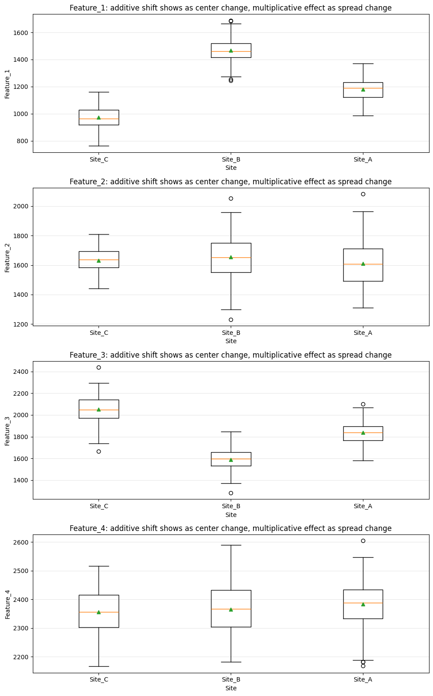

.. code:: ipython3

    # Harmonise "Site/Batch" using regression
    from block2_utils.HarmonisationEvaluation_functions import regression_harmonize_site
    
    features = [f"Feature_{i}" for i in range(1, n_features + 1)]
    
    df_harm, model_summary = regression_harmonize_site(
        df, feature_cols=features, site_col="Site", covariates=("Age", "Timepoint")
    )
    print("==" * 40)
    print("Model Summary")
    print(model_summary)
    print("==" * 40)
    print(df_harm.head())
    plot_before_after_by_site(df_harm, features)

.. parsed-literal::

    ================================================================================
    Model Summary
         Feature                    Formula   Site_pvalue        R2
    0  Feature_1  Feature_1 ~ Age + C(Site)  1.132386e-77  0.872862
    1  Feature_2  Feature_2 ~ Age + C(Site)  1.778094e-02  0.028970
    2  Feature_3  Feature_3 ~ Age + C(Site)  4.758890e-42  0.752549
    3  Feature_4  Feature_4 ~ Age + C(Site)  2.732957e-02  0.114791
    ================================================================================
       Subject   Age    Site  Feature_1  Feature_2  Feature_3  Feature_4  \
    0        1  56.5  Site_C      948.4     1698.0     2264.6     2391.0   
    1        2  68.0  Site_B     1369.4     1407.7     1658.3     2249.5   
    2        3  59.6  Site_C      951.2     1634.0     1911.2     2371.8   
    3        4  64.8  Site_A     1236.7     1732.8     1980.8     2424.6   
    4        5  54.9  Site_B     1402.8     1705.7     1847.4     2277.0   
    
       Feature_1_harm  Feature_2_harm  Feature_3_harm  Feature_4_harm  
    0     1171.984199     1697.920601     2052.005787     2400.625053  
    1     1112.330975     1385.165375     1890.028471     2254.501029  
    2     1179.444709     1634.088832     1694.269751     2381.505040  
    3     1262.359680     1755.131559     1968.946086     2409.839617  
    4     1126.036562     1682.454464     2097.451721     2281.663019  

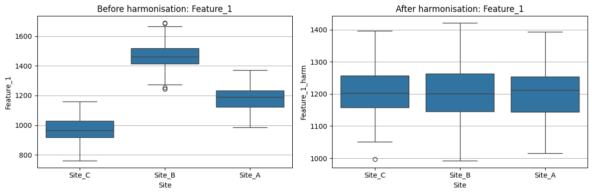

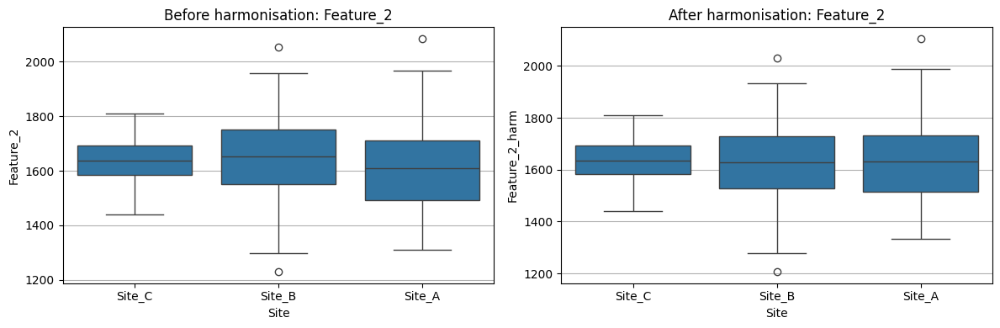

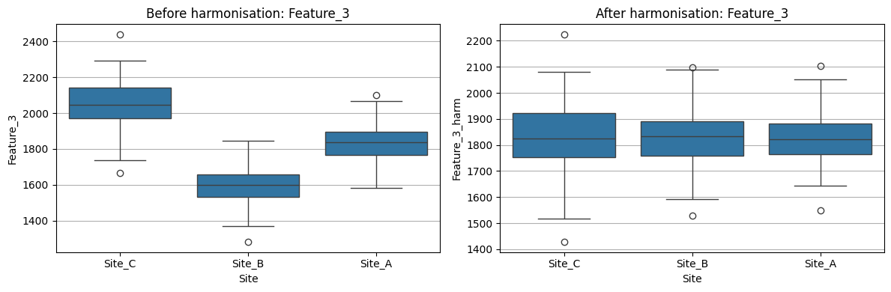

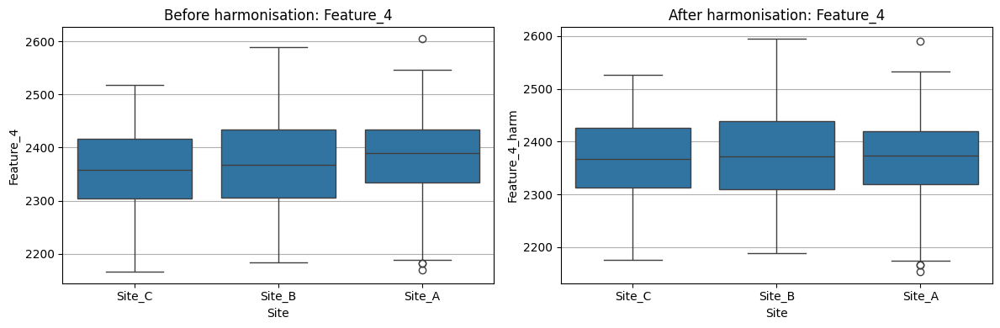

.. code:: ipython3

    # Harmonise "Site/Batch" using ComBat
    features = [f"Feature_{i}" for i in range(1, n_features + 1)]
    
    # original feature matrix
    data = df[features].to_numpy()
    
    # covariates dataframe
    covars = pd.DataFrame({"SITE": df["Site"], "Age": df["Age"]})
    
    # harmonize
    model, data_harm = harmonizationLearn(data, covars)
    
    # convert harmonized matrix to dataframe
    df_harm = pd.DataFrame(data_harm, columns=[f"{c}_harm" for c in features])
    
    # combine with original dataframe
    df_combined = pd.concat(
        [df.reset_index(drop=True), df_harm.reset_index(drop=True)], axis=1
    )
    print("==" * 40)
    print(df_combined.head())
    print("==" * 40)
    
    # Plot additive and multiplicative effects after combat
    plot_before_after_by_site(df_combined, features)

.. parsed-literal::

    ================================================================================
       Subject   Age    Site  Feature_1  Feature_2  Feature_3  Feature_4  \
    0        1  56.5  Site_C      948.4     1698.0     2264.6     2391.0   
    1        2  68.0  Site_B     1369.4     1407.7     1658.3     2249.5   
    2        3  59.6  Site_C      951.2     1634.0     1911.2     2371.8   
    3        4  64.8  Site_A     1236.7     1732.8     1980.8     2424.6   
    4        5  54.9  Site_B     1402.8     1705.7     1847.4     2277.0   
    
       Feature_1_harm  Feature_2_harm  Feature_3_harm  Feature_4_harm  
    0     1184.111864     1726.471789     2007.349130     2407.099135  
    1     1109.920866     1415.224545     1899.596468     2263.610672  
    2     1186.886636     1630.055202     1712.982216     2384.872901  
    3     1259.904773     1743.115037     1987.893596     2412.672437  
    4     1143.966770     1678.972066     2100.665324     2285.619012  
    ================================================================================

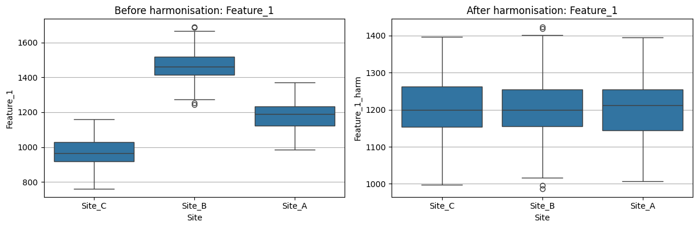

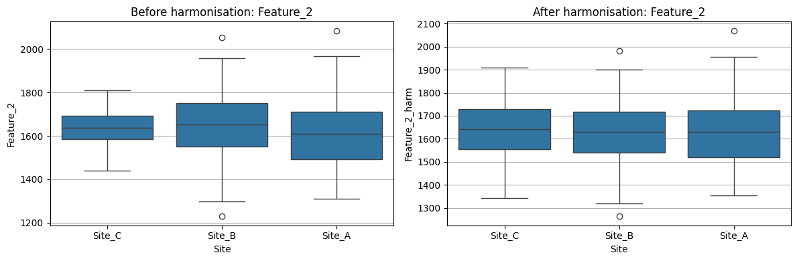

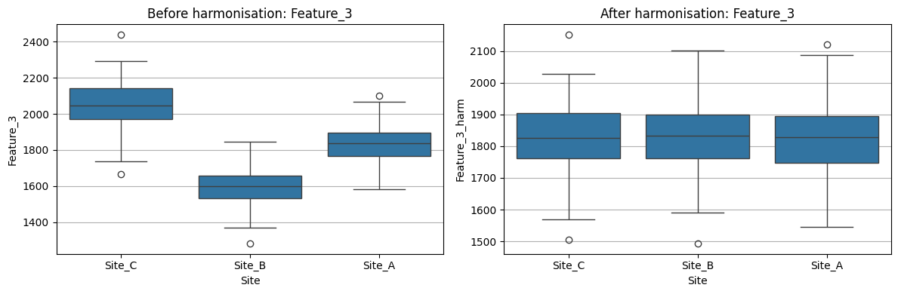

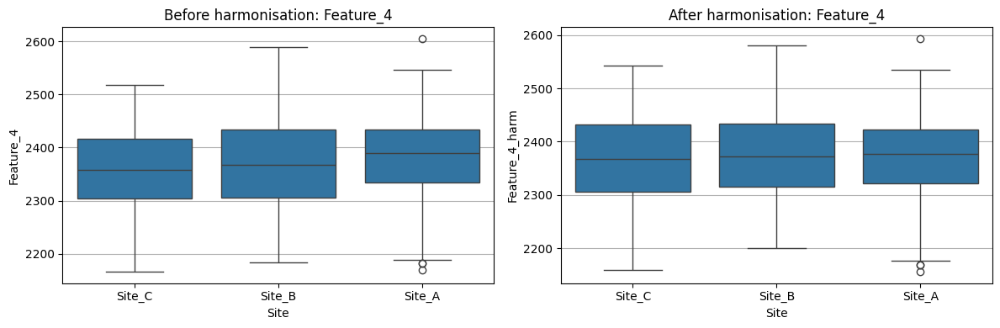

.. code:: ipython3

    import warnings
    warnings.filterwarnings("ignore")
    
    import pandas as pd
    
    from block2_utils.HarmonisationEvaluation_functions import (
        simulate_cross_sectional_harmonization_data,
        AdditiveEffect_long,
        MultiplicativeEffect_long,
        regression_harmonize_site,
    )
    from block2_utils.HarmonisationEvaluation_plots import plot_before_after_by_site
    
    ######## Simulate new data ########
    n_subjects=100
    n_sites=2
    n_features=2
    seed=1
    additive_shift = {"Site_B": {"Feature_1": 20, "Feature_2": -500}}
    multiplicative_scale = {"Site_B": {"Feature_1": 15.0}, "Site_A": {"Feature_2": 2.7}}
    
    df = simulate_cross_sectional_harmonization_data(
        n_subjects=n_subjects,
        n_sites=n_sites,
        n_features=n_features,
        seed=seed,
        additive_shift=additive_shift,
        multiplicative_scale=multiplicative_scale,
    )
    feature_cols = [f"Feature_{i}" for i in range(1, n_features + 1)]
    
    ####### Site/Batch Regression ###########
    df_reg_harm_full, model_summary = regression_harmonize_site(
        df, feature_cols=feature_cols, site_col="Site", covariates=("Age",)
    )
    reg_harm_feature_cols = [f"Feature_{i}_harm" for i in range(1, n_features + 1)]
    regression_additive_results = AdditiveEffect_long(
        data=df_reg_harm_full,
        idp_names=reg_harm_feature_cols,
        idvar="Subject",
        batchvar="Site",
        timevar=None,
        fix_eff=["Age"],
        ran_eff=["Subject"],
        do_zscore=True,
        verbose=False,
    )
    print("Site Regression Additive effect:")
    print(regression_additive_results)
    
    regression_multiplicative_results = MultiplicativeEffect_long(
        data=df_reg_harm_full,
        idp_names=reg_harm_feature_cols,
        idvar="Subject",
        batchvar="Site",
        timevar=None,
        fix_eff=["Age"],
        ran_eff=["Subject"],
        do_zscore=True,
        verbose=False,
    )
    
    print("Site Regression Multiplicative effect:")
    print(regression_multiplicative_results)
    
    ###### ComBat harmonisation #########
    features = [f"Feature_{i}" for i in range(1, n_features + 1)]
    
    data = df[features].to_numpy()
    covars = pd.DataFrame({
        "SITE": df["Site"],
        "Age": df["Age"]
    })
    
    model, data_harm = harmonizationLearn(data, covars)
    
    df_combat_harm = pd.DataFrame(
        data_harm,
        columns=[f"{c}_harm" for c in features]
    )
    # keep original features too
    df_combat = pd.concat(
        [
            df[["Subject", "Site", "Age"]].reset_index(drop=True),
            df[features].reset_index(drop=True),
            df_combat_harm.reset_index(drop=True),
        ],
        axis=1,
    )
    
    combat_feature_cols = [f"Feature_{i}_harm" for i in range(1, n_features + 1)]
    
    combat_additive_results = AdditiveEffect_long(
        data=df_combat,
        idp_names=combat_feature_cols,
        idvar="Subject",
        batchvar="Site",
        timevar=None,
        fix_eff=["Age"],
        ran_eff=["Subject"],
        do_zscore=True,
        verbose=False,
    )
    print("ComBat Additive effect:")
    print(combat_additive_results)
    combat_multiplicative_results = MultiplicativeEffect_long(
        data=df_combat,
        idp_names=combat_feature_cols,
        idvar="Subject",
        batchvar="Site",
        timevar=None,
        fix_eff=["Age"],
        ran_eff=["Subject"],
        do_zscore=True,
        verbose=False,
    )
    print("\n\nComBat Multiplicative effect:\n\n")
    print(combat_multiplicative_results)
    
    # Visualise
    print(feature_cols)
    
    print("\n\nBefore and after Regression:\n\n")
    plot_before_after_by_site(df_reg_harm_full, feature_cols)
    
    print("\n\nBefore and after ComBat:\n\n")
    plot_before_after_by_site(df_combat, feature_cols)
    

.. parsed-literal::

    Site Regression Additive effect:
              Feature      TestStat  df  p-value method
    0  Feature_2_harm  5.875795e-28   1      1.0   Wald
    1  Feature_1_harm  1.440366e-28   1      1.0   Wald
    Site Regression Multiplicative effect:
              Feature      ChiSq  DF       p-value   method
    0  Feature_1_harm  35.794151   1  2.193053e-09  Fligner
    1  Feature_2_harm   2.421919   1  1.196483e-01  Fligner
    ComBat Additive effect:
              Feature  TestStat  df   p-value method
    0  Feature_2_harm  0.014845   1  0.903024   Wald
    1  Feature_1_harm  0.009330   1  0.923051   Wald
    
    
    ComBat Multiplicative effect:
    
    
              Feature     ChiSq  DF   p-value   method
    0  Feature_1_harm  1.168476   1  0.279715  Fligner
    1  Feature_2_harm  0.927320   1  0.335560  Fligner
    ['Feature_1', 'Feature_2']
    
    
    Before and after Regression:
    
    

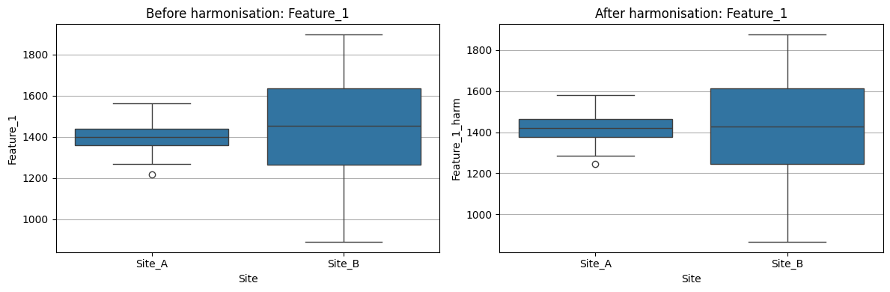

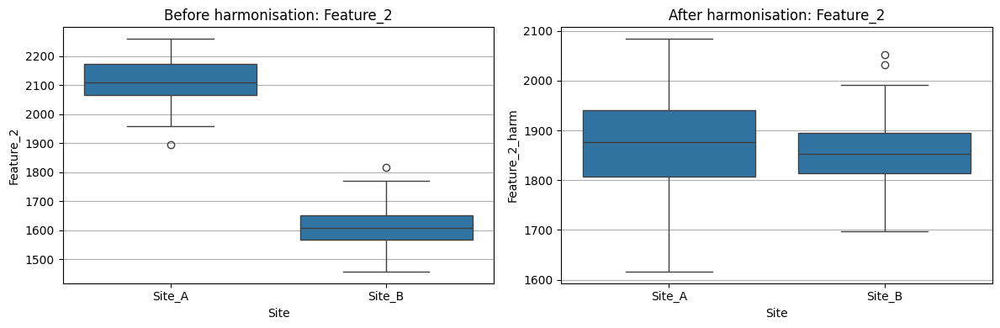

.. parsed-literal::

    
    
    Before and after ComBat:
    
    

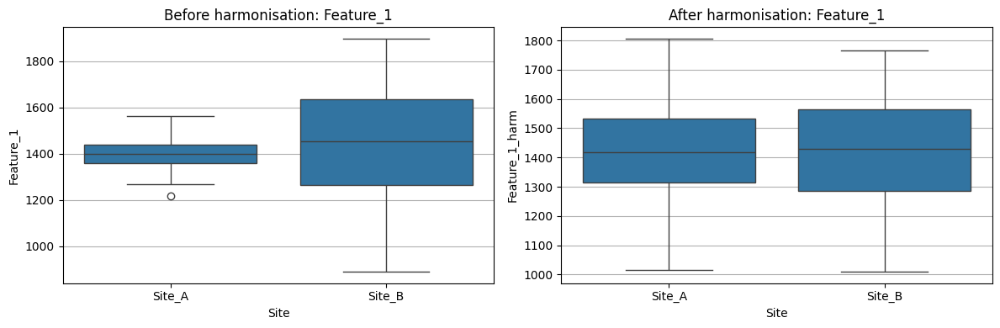

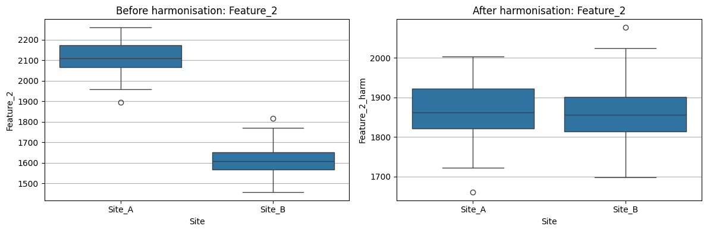

Longitudinal ComBat Harmonisation
=================================

Standard ComBat methods were originally developed for cross-sectional
data, where each subject contributes a single observation.

| In longitudinal studies, however, subjects are measured repeatedly
  over time.
| These repeated measurements introduce within-subject correlations that
  should be accounted for during harmonisation.

--------------

What does longitudinal ComBat do?
---------------------------------

Longitudinal ComBat extends the ComBat framework by incorporating
subject-level random effects within a mixed-effects modeling framework.

This allows the method to: - model repeated measurements from the same
subject, - preserve longitudinal biological trajectories, - and estimate
additive and multiplicative batch effects more appropriately for
longitudinal data.

--------------

Conceptual difference from standard ComBat
------------------------------------------

Standard ComBat
~~~~~~~~~~~~~~~

Primarily models:

.. math::

   y_{ij} = \alpha_j + \beta_j X_i + \gamma_{b(i)j} + \delta_{b(i)j}\epsilon_{ij}

where: - :math:`\gamma` represents additive batch effects, -
:math:`\delta` represents multiplicative batch effects.

This assumes observations are independent.

--------------

Longitudinal ComBat
~~~~~~~~~~~~~~~~~~~

Adds subject-level random effects:

.. math::

   y_{ij}(t) =
   \alpha_j + \beta_j X_i(t)
   + u_i
   + \gamma_{b(i)j}
   + \delta_{b(i)j}\epsilon_{ij}

where: - :math:`u_i` represents subject-specific random effects, -
repeated measurements within subjects are explicitly modeled.

This helps preserve within-subject longitudinal structure during
harmonisation.

--------------

Current Implementation
----------------------

At present, longitudinal ComBat is primarily available through an R
implementation.

One commonly used implementation is:

- **longCombat (R package)**
  https://github.com/jcbeer/longCombat

Python packages such as: - ``neuroCombat`` - ``neuroHarmonize``

mainly implement standard (cross-sectional) ComBat approaches.

--------------

Key Takeaway
------------

For longitudinal imaging studies, explicitly modeling repeated subject
measurements is important for reliable harmonisation.

Longitudinal ComBat extends standard ComBat by accounting for
within-subject dependence while still correcting additive and
multiplicative scanner/site effects.
