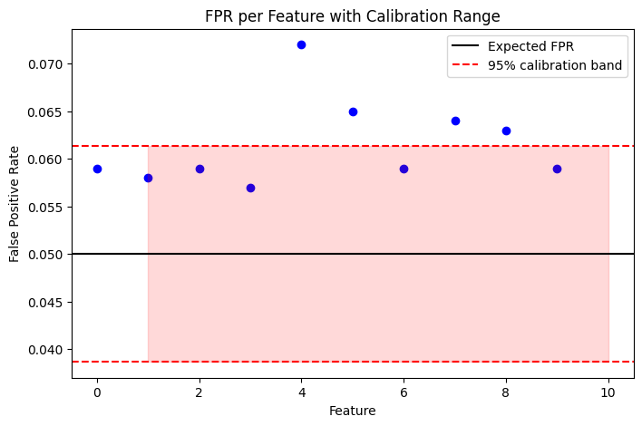

.. _B3_N1_ComBat_limitations:

Demonstrating the Limitations of ComBat and general location-scale models
=========================================================================

Overview
--------

ComBat is a widely used harmonization method that removes scanner or
site effects using a **location–scale model with empirical Bayes
estimation**. In its standard formulation, ComBat assumes that
scanner-related variability can be decomposed into additive
(mean-shifting) and multiplicative (variance-scaling) effects applied to
each feature. This approach relies on several key assumptions, among
which we focus on:

- **linear covariate effects**
- **additive and multiplicative (location–scale) scanner effects**
- **discrete scanner/site grouping**

While these assumptions lead to a tractable and effective model in many
settings, they impose a restrictive structure on the data-generating
process that may not hold in realistic neuroimaging applications.

--------------

Strategy
--------

To assess these limitations in a controlled setting, we use simulated
data with known ground truth. This allows us to isolate specific
violations of ComBat’s assumptions and directly evaluate their impact on
harmonization performance.

**Step 1 — Nonlinear biological effects**

We follow Pomponio et al. (2020) (i.e., ComBat-GAM paper) in explicitly
examining the impact of model specification for age effects. In
particular, we generate data with **nonlinear relationships** between
biological variables and the outcome (e.g. quadratic age effects). This
setting reflects well-established findings in neuroimaging, where many
associations—such as age-related trajectories of brain structure—are
inherently nonlinear.

In this context, we compare linear and nonlinear models for capturing
biological variation. When age effects are nonlinear, a linear
specification provides a poor fit to the data, as also demonstrated in
the reference study. Because standard ComBat relies on a **linear
adjustment for covariates**, it inherits this limitation: if the
biological model is misspecified, the harmonization step cannot
correctly disentangle biological signal from scanner-related variation.

As a result, even when scanner effects are appropriately modeled,
**misspecification of biological effects can lead to biased or distorted
estimates of the underlying signal** after harmonization.

**Step 2 — False positive rate (FPR) inflation under confounding**

We introduce **correlation** between scanner assignment and biological
variables, and include a **null feature with no true association**. This
mimics realistic multi-site scenarios where certain populations
(e.g. age groups, patient cohorts) are unevenly distributed across
scanners, maybe as different hospitals recruited different populations.
Under this setting, ComBat can induce spurious associations, leading to
inflated false positive rates. This occurs because the method assumes
independence between biological covariates and scanner effects; when
this assumption is violated, the adjustment can inadvertently
reintroduce structured bias into the data.

**Step 3 — Limitations of discrete scanner modeling**

We simulate **continuous scanner variation** (e.g. acquisition quality,
drift) and **within-scanner heterogeneity**. These factors are well
documented in neuroimaging, where variability arises not only between
scanners but also within the same scanner over time due to calibration
changes, hardware drift, or protocol differences. By construction,
ComBat treats scanners as discrete groups with homogeneous effects, and
therefore cannot capture this type of continuous or within-scanner
variability. As a consequence, residual scanner effects may remain after
harmonization, even when scanner labels are correctly specified.

--------------

Key message
-----------

The limitations demonstrated here are not specific to ComBat alone, but
arise more generally from the class of location–scale harmonization
models.

These approaches assume that scanner-related variability can be
adequately represented through additive shifts and variance rescaling
applied at the level of discrete groups, combined with linear covariate
adjustment. This framework imposes strong structural constraints on the
data-generating process, including: - linearity of biological effects, -
separability between biological and technical sources of variation, -
and categorical representation of acquisition differences.

When these assumptions are violated—as is often the case in real-world
neuroimaging data—these models may: - fail to remove complex scanner
effects, - distort true biological relationships, - or introduce
spurious associations, particularly in the presence of confounding.

More fundamentally, these issues reflect model misspecification: the
true data-generating process is typically nonlinear, high-dimensional,
and partially unobserved, whereas location–scale models enforce a
low-dimensional parametric structure.

Step 1 — Nonlinear biological effects
-------------------------------------

The following example illustrates one common failure mode: when the
underlying biological effects are nonlinear, the ComBat-style model can
mischaracterize the signal and produce biased harmonization.

We start by simulating a dataset with 800 subjects and 10 features, 
where the outcome is generated as a function of age, sex, and disease status. 
We create two scenarios: one with a linear relationship between age and the outcome, 
and another with a nonlinear (quadratic) relationship. 
We then fit both linear and quadratic models to the data and evaluate their performance 
using R² (goodness of fit) and RMSE (error magnitude).  

.. code:: ipython3

    # ---------------------------
    # Simulation parameters
    # ---------------------------
    n = 800
    n_features = 10
    
    # ---------------------------
    # Biological variables
    # ---------------------------
    age = np.random.uniform(20, 80, n)
    sex = np.random.binomial(1, 0.5, n)
    disease = np.random.binomial(1, 0.3, n)
    
    # ---------------------------
    # Scanner
    # ---------------------------
    scanner = np.random.choice(["A", "B", "C"], size=n)
    scanner_map = {"A": 1, "B": 2, "C": 3}
    scanner_num = np.array([scanner_map[s] for s in scanner])
    
    # ---------------------------
    # Generate true signal
    # ---------------------------
    Y_true_nonlinear = []
    Y_true_linear = []
    
    for j in range(n_features):
        beta_age_linear = np.random.uniform(0.4, 0.6)
        beta_age_nonlinear = np.random.uniform(0.1, 0.2)
        beta_sex = np.random.uniform(1.5, 2.5)
        beta_disease = np.random.uniform(4, 6)
    
        base_bio_nonlinear = (
            beta_age_nonlinear * (age - 50) ** 2 + beta_sex * sex + beta_disease * disease
        )
        base_bio_linear = beta_age_linear * age + beta_sex * sex + beta_disease * disease
    
        offset = np.random.normal(0, 1)
    
        y_j_nonlinear = base_bio_nonlinear + offset
        y_j_linear = base_bio_linear + offset
        Y_true_nonlinear.append(y_j_nonlinear)
        Y_true_linear.append(y_j_linear)
    
    Y_true_nonlinear = np.array(Y_true_nonlinear)
    Y_true_linear = np.array(Y_true_linear)
    
    # ---------------------------
    # Generate observed data
    # ---------------------------
    Y_obs_nonlinear = []
    Y_obs_linear = []
    
    for j in range(n_features):
        # Additive scanner effect
        scanner_effect = scanner_num * np.random.uniform(10, 20)
    
        # Multiplicative scanner effect
        scale_effect = scanner_num * np.random.uniform(0.5, 1.5)
        noise = np.random.normal(0, 2 * scale_effect, n)
    
        y_obs_j_nonlinear = Y_true_nonlinear[j] + scanner_effect + noise
        y_obs_j_linear = Y_true_linear[j] + scanner_effect + noise
        Y_obs_nonlinear.append(y_obs_j_nonlinear)
        Y_obs_linear.append(y_obs_j_linear)
    
    Y_obs_nonlinear = np.array(Y_obs_nonlinear)
    Y_obs_linear = np.array(Y_obs_linear)

We then fit linear and quadratic models to each feature in both the linear and nonlinear scenarios,
and compute R² and RMSE to assess model performance. The results demonstrate that when the true biological relationship is nonlinear, 
the linear model fails to capture the underlying signal, resulting in poor fit and high error, 
while the quadratic model provides an accurate representation of the data. 
This highlights the importance of correctly specifying the biological model when applying harmonization methods like ComBat, 
as misspecification can lead to biased estimates and distorted results.

.. image:: B3_N1_ComBat_limitations_4_0.png

.. code:: ipython3

    # ---------------------------
    # Fit linear and quadratic models
    # ---------------------------
    
    def fit_models(age, y):
        # Linear
        X_lin = age.reshape(-1, 1)
        lin = LinearRegression().fit(X_lin, y)
        y_lin = lin.predict(X_lin)
    
        # Quadratic
        X_quad = np.column_stack([age, age**2])
        quad = LinearRegression().fit(X_quad, y)
        y_quad = quad.predict(X_quad)
    
        r2_lin = lin.score(X_lin, y)
        r2_quad = quad.score(X_quad, y)
    
        rmse_lin = np.sqrt(mean_squared_error(y, y_lin))
        rmse_quad = np.sqrt(mean_squared_error(y, y_quad))
    
        return r2_lin, r2_quad, rmse_lin, rmse_quad

:math:`R^2`: (goodness of fit) - Measures how much variance in Y is
explained by age (and age²) - High :math:`R^2` → structure is captured
(shape) - Low :math:`R^2` → model cannot explain pattern

:math:`R^2` is about structure, not absolute accuracy

RMSE (error magnitude) - Measures distance to true values - Sensitive to
bias + scaling errors

RMSE is about accuracy, not just shape

.. code:: ipython3

    results_linear = []
    results_nonlinear = []
    
    for j in range(n_features):
        results_linear.append(fit_models(age, Y_true_linear[j]))
        results_nonlinear.append(fit_models(age, Y_true_nonlinear[j]))
    
    results_linear = np.array(results_linear)
    results_nonlinear = np.array(results_nonlinear)

.. parsed-literal::

    === LINEAR DATA ===
    R2 linear: 	 0.91893
    R2 quadratic:	 0.91919
    RMSE linear:	 2.61830
    RMSE quadratic:  2.61422
    
    === NONLINEAR DATA ===
    R2 linear:  	 0.00224
    R2 quadratic: 	 0.99368
    RMSE linear:  	 35.53783
    RMSE quadratic:  2.61422

Final Interpretation: When the true biological relationship is linear, both linear and
quadratic models provide an equivalent fit (R² ≈ 0.91, RMSE ≈ 2.6),
indicating that a linear specification is sufficient to capture the
underlying signal.

In contrast, when the true relationship is nonlinear, the linear model
fails to explain the data (R² ≈ 0.003) and yields very large errors
(RMSE ≈ 43), while the quadratic model achieves near-perfect fit (R² ≈
0.996, RMSE ≈ 2.6). This demonstrates that linear models are
fundamentally incapable of capturing nonlinear biological effects.

These results highlight that **model specification plays a critical role
in accurately representing biological variation**. When the true
relationship is nonlinear, using a linear model leads to severe
mischaracterization of the signal, both in terms of explained variance
and prediction accuracy.

Step 2 — False positive rate (FPR) inflation under confounding
--------------------------------------------------------------

In real datasets scanner/site is often **correlated with biological
variables**, e.g. different hospitals recruit different populations but
ComBat, and L/S models generally, assumes that scanner effects are
independent of biological effects.

We simulate a setting where: - scanner and biology are correlated -
there is **no true group effect**

We then test whether ComBat introduces false positives. To obtain a
reliable estimate of the false positive rate, we repeat the entire
simulation multiple times with different random seeds.

.. code:: ipython3

    # Run multiple simulations to assess FPR and correlations
    def run_fpr_simulation(seed, n=800, n_features=20):
    
        np.random.seed(seed)
    
        # Scanner
        scanner = np.random.choice(["A", "B", "C"], size=n)
        scanner_map = {"A": 0, "B": 1, "C": 2}
        scanner_num = np.array([scanner_map[s] for s in scanner])
    
        # correlated age
        age = np.zeros(n)
        for i, s in enumerate(scanner):
            if s == "A":
                age[i] = np.random.normal(30, 5)
            elif s == "B":
                age[i] = np.random.normal(50, 5)
            else:
                age[i] = np.random.normal(70, 5)
    
        sex = np.random.binomial(1, 0.5, n)
        disease = np.random.binomial(1, 0.3, n)
    
        Y_obs = []
        Y_true = []
    
        # Simulate observed features with scanner effects and interactions
        for j in range(n_features):
            scanner_effect = scanner_num * np.random.uniform(1.5, 3)
            interaction = scanner_num * 0.15 * age
            noise = np.random.normal(0, 2, n)
    
            # TRUE BIO: all linear effects + interaction
            true_bio = 0.05 * (age - 50) + 2 * sex + 5 * disease + 0.03 * age * disease
    
            y_j = true_bio + scanner_effect + interaction + noise
            Y_obs.append(y_j)
            Y_true.append(true_bio)
    
        Y_obs = np.array(Y_obs)
        Y_true = np.array(Y_true)
    
        # null group
        group = np.random.binomial(1, 0.5, n)
    
        covars = pd.DataFrame(
            {"batch": scanner, "age": age, "sex": sex, "group": group, "disease": disease}
        )
    
        combat_result = neuroCombat(
            dat=Y_obs,
            covars=covars,
            batch_col="batch",
            continuous_cols=["age"],
            categorical_cols=["sex", "disease", "group"],
        )
    
        Y_combat = combat_result["data"]
    
        # -----------------------------
        # P-values
        # -----------------------------
        pvals = []
    
        for j in range(n_features):
            p = ttest_ind(Y_combat[j][group == 0], Y_combat[j][group == 1]).pvalue
            pvals.append(p)
    
        pvals = np.array(pvals)
    
        # -----------------------------
        # Correlations (KEY ADDITION)
        # -----------------------------
        corr_scanner_age = np.corrcoef(scanner_num, age)[0, 1]
        corr_scanner_group = np.corrcoef(scanner_num, group)[0, 1]
    
        return pvals, corr_scanner_age, corr_scanner_group

We then run this simulation repeatedly to estimate the false positive rate under the null.
Specifically, we perform 1,000 independent simulation replicates, each with 10 features, 
and record the resulting p-values as well as the scanner-age and scanner-group correlations.

We then compute the observed false positive rate (FPR) as the proportion of p-values below 0.05,
and summarize the scanner-age and scanner-group correlations across replicates.

.. parsed-literal::

    Mean correlation scanner-age:	0.95619
    Mean correlation scanner-group:	0.00069
    FPR per feature: [0.059 0.058 0.059 0.057 0.072 0.065 0.059 0.064 0.063 0.059]

When interpreting the observed False Positive Rate (FPR) in our
simulation experiments, it is important to account for the variability
that arises from the finite number of simulation replicates. Under the
null hypothesis, the number of spurious group effects detected across
:math:`N` simulations follows a binomial distribution with probability
:math:`p = 0.05`. Even if a method is well-calibrated, we do not expect
the observed FPR to be exactly :math:`0.05` in every experiment due to
random variation. To determine whether an observed FPR is meaningfully
higher than expected, we compute an upper confidence bound for
:math:`\hat{p}`, the sample estimate of the FPR, using a normal
approximation to the binomial:

.. math::

   \hat{p} \pm 1.645 \times \sqrt{\frac{\hat{p}(1-\hat{p})}{N}}

This expression gives the 95th percentile (one-sided) of the sampling
distribution of the FPR under the null.

.. parsed-literal::

    Expected FPR: 0.05
    95% confidence interval for FPR under null: 0.03866, 0.06134

Substituting :math:`\hat{p}=0.05` and :math:`N=1000`, we get an upper
bound of approximately 0.06 and lower bound of 0.04. In other words,
even a well-calibrated method can yield an observed FPR as high as 6% or
as low as 4% just by chance. However, if the FPR exceeds the upper
bound, it suggests the method is truly inflating Type I error, not just
experiencing random fluctuation. Instead, an FPR below 4% indicates that
the method is overly conservative, potentially sacrificing power to
avoid false positives. Thus, in our simulation studies, FPRs above 0.06
are interpreted as significant inflation, while values below 0.04 signal
excessive conservatism.

We plot the FPR for each feature across the 1,000 simulation replicates, 
along with the 95% confidence band for the expected FPR under the null hypothesis. 
This visualization allows us to assess whether ComBat is inflating false positives 
in the presence of confounding between scanner and biological variables.

ComBat leads to FPR values that are systematically above the nominal
level (0.05) and for several features exceed the 95% calibration band,
indicating **inflated false positive rates** .

Key takeaway

| Even when ComBat reduces apparent scanner effects, it does not ensure
  valid statistical inference.
| In particular, it can lead to **inflated false positive rates**,
  highlighting a limitation of location–scale harmonization methods
  under realistic data conditions.

Step 3 — Limitations of Discrete Scanner Modeling
-------------------------------------------------

ComBat and, as far as this author’s knowledge goes, all other
harmonization approaches model scanner effects using **discrete scanner
identifiers**. However, in real neuroimaging data: - scanner-related
variability is often **continuous** - e.g. signal-to-noise ratio (SNR) -
contrast-to-noise ratio (CNR) - acquisition drift - and varies **within
scanner** as well.

Simulation design: we generate a dataset with 800 subjects and 20 features, 
where the outcome is generated as a function of age, sex, and disease status.

We generate then discrete scanner IDs (A, B, C), a continuous latent
variable representing scanner quality (e.g., SNR), and a continuous 
scanner effect that depends on this latent variable.

.. code:: ipython3

    # Simulation parameters
    n = 800
    n_features = 20
    
    # scanner IDs
    scanner = np.random.choice(["A", "B", "C"], size=n)
    scanner_map = {"A": 0, "B": 1, "C": 2}
    scanner_num = np.array([scanner_map[s] for s in scanner])
    
    # continuous scanner variation (IQM-like)
    scanner_quality = (
        scanner_num + np.random.normal(0, 0.8, n)  # large within-scanner variation
    )
    
    age = np.random.uniform(20, 80, n)
    sex = np.random.binomial(1, 0.5, n)
    disease = np.random.binomial(1, 0.3, n)
    
    Y_obs = []
    Y_true = []
    
    for j in range(n_features):
        # TRUE BIO: all linear effects + interaction
        true_bio = (
            0.05 * (age - 50)
            + abs(np.random.uniform(1.5, 2.5)) * sex
            + 5 * disease
            + 0.03 * age * disease
        )
    
        base_scanner_effect = scanner_num * abs(np.random.uniform(1.5, 3))
    
        # IMPORTANT: scanner effect depends on continuous variable
        continuous_scanner_effect = 3 * scanner_quality  # NOT discrete
    
        # small noise
        noise = np.random.normal(0, 2, n)
    
        y_j = true_bio + continuous_scanner_effect + base_scanner_effect + noise
        Y_obs.append(y_j)
        Y_true.append(true_bio)
    
    Y_obs = np.array(Y_obs)
    Y_true = np.array(Y_true)

Apply ComBat

.. code:: ipython3

    covars = pd.DataFrame({"batch": scanner, "age": age, "disease": disease, "sex": sex})
    
    combat_result = neuroCombat(
        dat=Y_obs,
        covars=covars,
        batch_col="batch",
        continuous_cols=["age"],
        categorical_cols=["sex", "disease"],
    )
    
    Y_combat = combat_result["data"]

We plot the observed data, the ComBat-corrected data, and the true biological signal 
against scanner quality for a single feature. We can observe that while ComBat reduces 
the association between scanner quality and the observed data, it does not fully eliminate it, 
and a clear residual relationship remains after harmonization.

.. image:: B3_N1_ComBat_limitations_22_0.png

We then compute the correlation between scanner quality and the observed data,
the ComBat-corrected data, and the true biological signal. 
This allows us to assess whether ComBat successfully removes the association between scanner quality and the outcome,
and whether any residual correlation remains after harmonization.

.. code:: ipython3

    corr_residual = np.corrcoef(scanner_quality, Y_combat[j])[0, 1]
    corr_raw = np.corrcoef(scanner_quality, Y_obs[j])[0, 1]
    corr_bio = np.corrcoef(scanner_quality, Y_true[j])[0, 1]

.. parsed-literal::

    Biological correlation:	-0.05599
    Raw observed correlation:0.71508
    After ComBat:		 0.31461

| ComBat: - reduces the association between scanner quality and the
  observed data
| - partially removes scanner-related variability
| - decreases the correlation from ~0.7 (raw) to ~0.3

BUT:

- a clear residual relationship remains between scanner quality and the
  corrected data
- the fitted trend and non-zero correlation indicate **incomplete
  removal of scanner effects**
- this residual dependence is not present in the true biological signal
  (~0), confirming it is an artifact

Key takeaway

| ComBat reduces scanner-induced variability but does not fully
  eliminate it.
| Residual associations with continuous scanner-related factors remain,
  highlighting a limitation of discrete location–scale harmonization
  methods when scanner variation is continuous.

