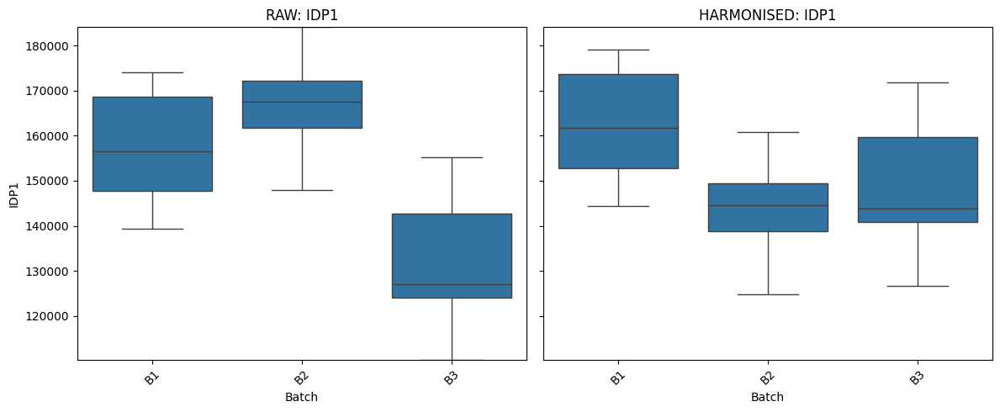
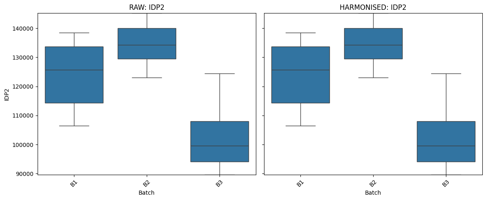
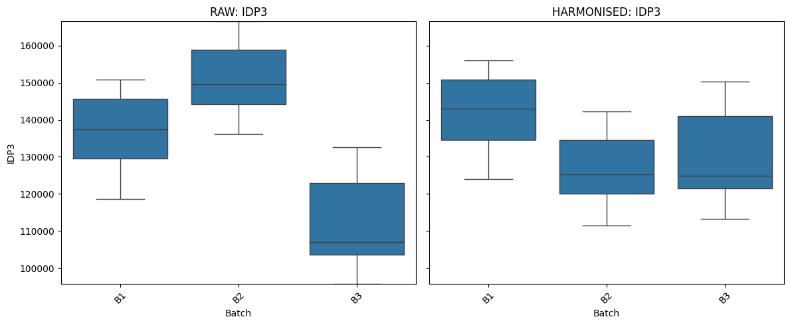
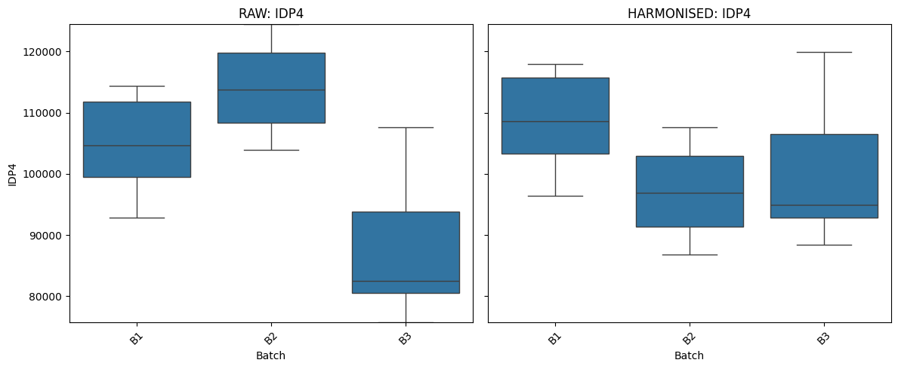
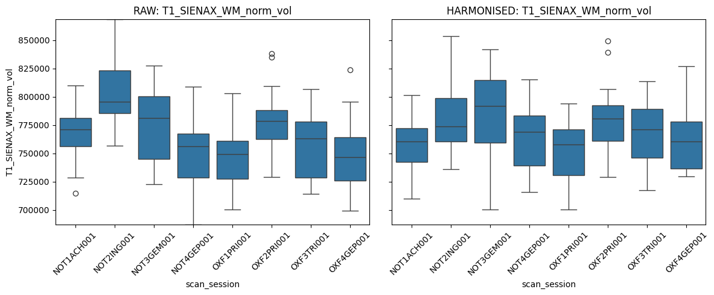

Positioning the IQM-Based Mixed-Effects Harmonisation Framework
===============================================================

In this course, we will demonstrate an IQM-based harmonisation workflow
for removing batch effects from imaging-derived phenotypes (IDPs).

The framework implements a relatively lightweight and interpretable
harmonisation strategy within a linear mixed-effects modelling
framework. Rather than modelling site effects directly at the level of
the imaging-derived phenotypes (IDPs), the approach uses image quality
metrics (IQMs) to identify latent nuisance structure associated with
site variability. Additive (mean-shift) and multiplicative (variance
scaling) correction is then applied selectively using mixed-effects
models.

Conceptually, the framework can be viewed as a QC-informed harmonisation
approach in which:

- scanner/site information is used to identify nuisance-related QC
  structure,
- biologically meaningful covariates are explicitly protected during QC
  selection,
- and correction is applied only when statistically justified.

Importantly, harmonisation is not imposed uniformly across all
observations or phenotypes. Instead, the framework adaptively
determines:

- which QC components are relevant for a given IDP,
- whether additive correction is appropriate,
- and whether multiplicative scaling sufficiently improves model fit to
  justify correction.

This differs from direct batch-normalisation approaches, such as ComBat
harmonisation, where site correction is applied by explicitly specifying
batch labels.

The framework is intentionally simple and transparent:

- modelling assumptions are linear,
- nuisance structure remains interpretable through QC variables,
- and harmonisation can be evaluated using standard mixed-effects
  diagnostics.

Such an approach may be particularly useful in:

- smaller datasets or setting with limited number of data points per
  site
- longitudinal studies,

More advanced approaches, such as
`BARTharm <https://doi.org/10.1101/2025.06.04.657792>`__, extend
QC-informed harmonisation into substantially more flexible modelling
frameworks. BARTharm uses Bayesian Additive Regression Trees (BART) to
capture nonlinear relationships and higher-order interactions between
image-quality structure, scanner effects, and biological variation. This
approaches may provide a more robust representation of complex nuisance
structure in large and heterogeneous datasets where scanner effects are
unlikely to be adequately described by linear relationships alone.

Accordingly, the present workflow should be viewed as:

- a transparent and interpretable mixed-effects implementation,
- a useful pedagogical introduction to IQM-guided harmonisation,
- and a practical approach for smaller or clinically constrained
  datasets.

Together, these methods illustrate a broader shift away from direct
batch-label correction toward harmonisation strategies that explicitly
leverage image-quality information to characterise nuisance variation,
thereby reducing technical variability without compromising biological
variability or inducing overcorrection.

Further reading
---------------

Comprehensive methodological documentation can be found at `this
link <https://github.com/gvbhalerao591/Harmonisation-Paper/blob/main/manuscript_materials/AppendixA-IQM-informed_harmonisation.pdf>`__.

.. code:: ipython3

    # install packages if required
    %pip install numpy scipy pandas scikit-learn statsmodels matplotlib seaborn

Inputs Required for the Code
----------------------------

The required files are stored in the ``iqm_light_data`` folder. This
folder contains:

- **simulated_data.csv** — contains all IQMs and IDPs for each
  observation in the dataset. In this dataset we have one IDP to be
  harmonised and several QC metrics.

- **idp_list.csv** — contains the list of IDPs to be harmonised. These
  must match the corresponding column names in *simulated_data.csv*.

- **iqm_list.csv** — contains the list of IQMs to be used in the
  harmonisation workflow. These must match the corresponding column
  names in *simulated_data.csv*.

Arguments to the Harmonisation Function
---------------------------------------

We will use the ``iqm_harmonise`` function from
``iqm_harmonisation_light.py``. We recommend reviewing both the
implementation and the inline documentation describing the function
arguments before applying the workflow to your own datasets.

Harmonisation Parameters
------------------------

In this example, we specify the following arguments:

- **``preserve_covars``** Covariates representing biological sources of
  variability that should be preserved during harmonisation (e.g.,
  ``age``).

- **``adjust_covars``** Additional covariates to be included in the
  harmonisation model as adjustment terms (e.g., ``timepoint``).

- **``reverse_guard_covars``** Covariates included in the reverse-guard
  model (e.g., ``age``) to explicitly safeguard biologically meaningful
  variation and minimise the risk of overcorrection.

- **``categorical_covars``** A list of covariates to be treated as
  categorical factors within the model.

- **``p_thr``** Statistical significance threshold used during
  QC-feature selection. Any image-quality metric (IQM/QC feature)
  significantly associated with IDPs or protected covariates will be
  excluded from the correction model to avoid removal of biologically
  relevant signal.

- **``apply_pca``** Enables principal component analysis (PCA) on QC
  features prior to harmonisation.

- **``iqm_variance``** Proportion of variance in QC features to retain
  when deriving PCA components.

- **``enable_multiplicative``** Enables multiplicative harmonisation
  effects in addition to additive correction. As this substantially
  increases computational cost, it is disabled in the present example.

Outputs
-------

After running the IQM-based harmonisation workflow, several output files
will be generated:

- *iqm_harmonised.csv*: contains the original and harmonised IDPs
  (``harmonised_<idp_name>``).
- \*qc_selection\_\_details.csv\*: contains statistical significance
  measures and summary information for QC selection.
- \*selected\_\_by_volume.csv\*: contains the QC variables selected for
  each IDP.

Visualisation
-------------

Next, we will visualise the distribution of IDPs across batches using
the outputs from *iqm_harmonised.csv*.

*Can you see which QC features were selected for correction with the
IDPs, and how do the IDP distributions appear across sites/batches
before and after harmonisation?*

.. code:: ipython3

    # Import packages and load data
    import pandas as pd
    import matplotlib.pyplot as plt
    import seaborn as sns
    
    from pathlib import Path
    repo_root = Path.cwd().parent.parent
    data_file     = repo_root / "data" / "data_block4" / "iqm_light_data" / "Simulated_data" / "simulated_data.csv"
    iqm_list_file = repo_root / "data" / "data_block4" / "iqm_light_data" / "Simulated_data" / "iqm_list.csv"
    idp_list_file = repo_root / "data" / "data_block4" / "iqm_light_data" / "Simulated_data" / "idp_list.csv"
    
    from block4_utils.iqm_harmonisation_light import iqm_harmonise
    
    df = pd.read_csv(data_file)
    idp_list = pd.read_csv(idp_list_file, header=None).iloc[:, 0].dropna().astype(str).str.strip().tolist()
    iqm_list = pd.read_csv(iqm_list_file, header=None).iloc[:, 0].dropna().astype(str).str.strip().tolist()
    
    # Apply harmonisation
    data_out, qc_selection, add_detail_df, mult_detail_df, summary_df = iqm_harmonise(
        data=df,
        idp_list=idp_list,
        qc_list=iqm_list,
        preserve_covars=("Age",),
        adjust_covars=("Timepoint",),
        reverse_guard_covars=("Age",),
        categorical_covars=("Timepoint", "Batch"),
        batch_col="Batch",
        subject_col="Subject",
        age_source_col="Age",
        batch_source_col="Batch",
        age_col="Age",
        p_thr=0.05,
        apply_pca=True,
        iqm_variance=95,
        verbose_model_fits=False,
        enable_multiplicative=False
    )
    
    # Visualise
    for idp in idp_list:
        raw_col = idp
        harm_col = f"harmonised_{idp}"
    
        fig, axes = plt.subplots(1, 2, figsize=(12, 5), sharey=True)
    
        ymin = min(data_out[raw_col].min(), data_out[harm_col].min())
        ymax = max(data_out[raw_col].max(), data_out[harm_col].max())
    
        sns.boxplot(data=data_out, x="Batch", y=raw_col, ax=axes[0])
        axes[0].set_title(f"RAW: {idp}")
        axes[0].tick_params(axis="x", rotation=45)
        axes[0].set_ylim(ymin, ymax)
    
        sns.boxplot(data=data_out, x="Batch", y=harm_col, ax=axes[1])
        axes[1].set_title(f"HARMONISED: {idp}")
        axes[1].tick_params(axis="x", rotation=45)
        axes[1].set_ylim(ymin, ymax)
    
        plt.tight_layout()
        plt.show()

.. parsed-literal::

    === IQM Harmonization (Flexible Version) ===
    P-value threshold: 0.0500
    Max QCs per volume: inf
    PCA variance threshold: 95.0%
    Apply PCA: True
    Preserve covars: ['Age']
    Adjust covars: ['Timepoint']
    Categorical covars: ['Timepoint', 'Batch']
    Reverse-guard covars: ['Age']
    
    Step 1: Preparing QC metrics...
      PCA input shape: (48, 6)
      Retaining PCs: 1 (99.94%)
    
    Step 1b: Caching biology-only fits for multiplicative stage...
      Biology-only cache built.
    
    Step 2: Selecting QCs for ADDITIVE correction...
      Criteria: batch-driven, not preserve-covariate-driven
    
    === Additive selection: IDP1 ===
    
    === Additive selection: IDP2 ===
    
    === Additive selection: IDP3 ===
    
    === Additive selection: IDP4 ===
      QCs selected: min=0, max=1, mean=0.8
    
    Step 3: MULTIPLICATIVE correction disabled.
    
    Step 4: Applying corrections...
    
    === Volume: IDP1 ===
      Additive correction: applying 1 QC(s) -> ['QC1']
      Multiplicative correction skipped.
    
    === Volume: IDP2 ===
      Additive correction: skipped (no QCs passed)
      Multiplicative correction skipped.
    
    === Volume: IDP3 ===
      Additive correction: applying 1 QC(s) -> ['QC1']
      Multiplicative correction skipped.
    
    === Volume: IDP4 ===
      Additive correction: applying 1 QC(s) -> ['QC1']
      Multiplicative correction skipped.
    
    Step 5: Saving results...
      Data saved: iqm_harmonised.csv
      Summary saved: qc_selection_summary.csv
      Additive details saved: qc_selection_additive_details.csv
      Multiplicative details saved: qc_selection_multiplicative_details.csv
      Selected QC lists saved.
    
    === SUMMARY ===
    IDP1: additive=1 QC(s), multiplicative=0 QC(s), multiplicative_applied=False
    IDP2: additive=0 QC(s), multiplicative=0 QC(s), multiplicative_applied=False
    IDP3: additive=1 QC(s), multiplicative=0 QC(s), multiplicative_applied=False
    IDP4: additive=1 QC(s), multiplicative=0 QC(s), multiplicative_applied=False
    
    Done!

.. parsed-literal::

    /Users/psyc1586_admin/OHBM2026_educational_harmonisation/latest/OHBM2026_Educational_course_harmonization/.venv/lib/python3.12/site-packages/statsmodels/regression/mixed_linear_model.py:1564: RuntimeWarning: divide by zero encountered in log
      likeval -= self.n_totobs * np.log(qf) / 2.

Real data examples:
-------------------

DPUK PET-MR dataset
~~~~~~~~~~~~~~~~~~~

We have applied this method on the T1w IDPs from Dementias Platform UK
PET-MR dataset. More details are in this
`preprint <https://doi.org/10.64898/2026.04.21.26351106>`__.

ON-Harmony Dataset
~~~~~~~~~~~~~~~~~~

Below is example code demonstrating how the IQM-based harmonisation
workflow can be applied to a test-retest dataset such as
`ON-Harmony <https://openneuro.org/datasets/ds004712/versions/2.0.1>`__.
See the data and prebaked results in folder
``<repo_dir>/data/data_block4/iqm_light_data/Real_data/prebaked``.

For the purposes of this workshop, attendees can skip the execution and
directly inspect the provided ``.csv`` and ``.png`` visualisations.

The provided figures show side-by-side boxplots of raw and harmonised
IDPs across different batches/scanners and are intended to illustrate
the qualitative effects of harmonisation.

Please note that the On-Harmony dataset is based on a test–retest
acquisition design and is therefore already relatively well harmonised.
Consequently, visual differences between raw and harmonised
distributions may appear modest, particularly in univariate summaries.

.. code:: ipython3

    # IMPORTNAT: Running this code might take time so you can skip this and directly see the files and plots already generated 
    # See <repo_dir>/data/data_block4/iqm_light_data/Real_data/prebaked
    
    import pandas as pd
    import matplotlib.pyplot as plt
    import seaborn as sns
    
    from pathlib import Path
    repo_root = Path.cwd().parent.parent
    data_file     = repo_root / "data" / "data_block4" / "iqm_light_data" / "Real_data" / "onharmony.csv"
    iqm_list_file = repo_root / "data" / "data_block4" / "iqm_light_data" / "Real_data" / "iqm_list.csv"
    idp_list_file = repo_root / "data" / "data_block4" / "iqm_light_data" / "Real_data" / "idp_list.csv"
    
    from block4_utils.iqm_harmonisation_light import iqm_harmonise
    
    df = pd.read_csv(data_file)
    idp_list = pd.read_csv(idp_list_file, header=None).iloc[:, 0].dropna().astype(str).str.strip().tolist()
    iqm_list = pd.read_csv(iqm_list_file, header=None).iloc[:, 0].dropna().astype(str).str.strip().tolist()
    
    
    data_out, qc_selection, add_detail_df, mult_detail_df, summary_df = iqm_harmonise(
        data=df,
        idp_list=idp_list,
        qc_list=iqm_list,
        preserve_covars=("age",),
        adjust_covars=(),
        reverse_guard_covars=("age",),
        categorical_covars=("scan_session",),
        batch_col="scan_session",
        subject_col="subject",
        age_source_col="age",
        batch_source_col="scan_session",
        age_col="age",
        iqm_variance=95,
        p_thr=0.05,
        apply_pca=True,
        verbose_model_fits=False,
        maxiter=500,
        enable_multiplicative=True
    )
    # Visualise
    for idp in idp_list:
        raw_col = idp
        harm_col = f"harmonised_{idp}"
    
        fig, axes = plt.subplots(1, 2, figsize=(12, 5), sharey=True)
    
        ymin = min(data_out[raw_col].min(), data_out[harm_col].min())
        ymax = max(data_out[raw_col].max(), data_out[harm_col].max())
    
        sns.boxplot(data=data_out, x="scan_session", y=raw_col, ax=axes[0])
        axes[0].set_title(f"RAW: {idp}")
        axes[0].tick_params(axis="x", rotation=45)
        axes[0].set_ylim(ymin, ymax)
    
        sns.boxplot(data=data_out, x="scan_session", y=harm_col, ax=axes[1])
        axes[1].set_title(f"HARMONISED: {idp}")
        axes[1].tick_params(axis="x", rotation=45)
        axes[1].set_ylim(ymin, ymax)
    
        plt.tight_layout()
        plt.show()

.. parsed-literal::

    === IQM Harmonization (Flexible Version) ===
    P-value threshold: 0.0500
    Max QCs per volume: inf
    PCA variance threshold: 95.0%
    Apply PCA: True
    Preserve covars: ['age']
    Adjust covars: []
    Categorical covars: ['scan_session']
    Reverse-guard covars: ['age']
    
    Step 1: Preparing QC metrics...
      Removing 3 zero-variance QCs
      ['T1w_spacing_x', 'T1w_spacing_y', 'T1w_spacing_z']
      PCA input shape: (120, 16)
      Retaining PCs: 5 (95.96%)
    
    Step 1b: Caching biology-only fits for multiplicative stage...
      Biology-only cache built.
    
    Step 2: Selecting QCs for ADDITIVE correction...
      Criteria: batch-driven, not preserve-covariate-driven
    
    === Additive selection: T1_SIENAX_WM_norm_vol ===
      QCs selected: min=4, max=4, mean=4.0
    
    Step 3: Selecting QCs for MULTIPLICATIVE correction...
      NOTE: Multiplicative correction is computationally more intensive in the current Python implementation because it relies on repeated mixed-effects model fitting.
    
    Step 3: Selecting QCs for MULTIPLICATIVE correction...
      KEY: Using cached biology-only residual proxy
      Criteria: batch-driven, NOT strongly variance-driven
    
    === Multiplicative selection: T1_SIENAX_WM_norm_vol ===

.. parsed-literal::

    /Users/psyc1586_admin/OHBM2026_educational_harmonisation/latest/OHBM2026_Educational_course_harmonization/.venv/lib/python3.12/site-packages/statsmodels/regression/mixed_linear_model.py:1564: RuntimeWarning: divide by zero encountered in log
      likeval -= self.n_totobs * np.log(qf) / 2.
    /Users/psyc1586_admin/OHBM2026_educational_harmonisation/latest/OHBM2026_Educational_course_harmonization/notebooks/block04/block4_utils/iqm_harmonisation_light.py:365: RuntimeWarning: invalid value encountered in scalar subtract
      lr_stat = 2.0 * (full_fit.llf - reduced_fit.llf)
    /Users/psyc1586_admin/OHBM2026_educational_harmonisation/latest/OHBM2026_Educational_course_harmonization/.venv/lib/python3.12/site-packages/statsmodels/regression/mixed_linear_model.py:1564: RuntimeWarning: divide by zero encountered in log
      likeval -= self.n_totobs * np.log(qf) / 2.
    /Users/psyc1586_admin/OHBM2026_educational_harmonisation/latest/OHBM2026_Educational_course_harmonization/notebooks/block04/block4_utils/iqm_harmonisation_light.py:365: RuntimeWarning: invalid value encountered in scalar subtract
      lr_stat = 2.0 * (full_fit.llf - reduced_fit.llf)
    /Users/psyc1586_admin/OHBM2026_educational_harmonisation/latest/OHBM2026_Educational_course_harmonization/.venv/lib/python3.12/site-packages/statsmodels/regression/mixed_linear_model.py:1564: RuntimeWarning: divide by zero encountered in log
      likeval -= self.n_totobs * np.log(qf) / 2.
    /Users/psyc1586_admin/OHBM2026_educational_harmonisation/latest/OHBM2026_Educational_course_harmonization/notebooks/block04/block4_utils/iqm_harmonisation_light.py:365: RuntimeWarning: invalid value encountered in scalar subtract
      lr_stat = 2.0 * (full_fit.llf - reduced_fit.llf)
    /Users/psyc1586_admin/OHBM2026_educational_harmonisation/latest/OHBM2026_Educational_course_harmonization/.venv/lib/python3.12/site-packages/statsmodels/regression/mixed_linear_model.py:1564: RuntimeWarning: divide by zero encountered in log
      likeval -= self.n_totobs * np.log(qf) / 2.
    /Users/psyc1586_admin/OHBM2026_educational_harmonisation/latest/OHBM2026_Educational_course_harmonization/notebooks/block04/block4_utils/iqm_harmonisation_light.py:365: RuntimeWarning: invalid value encountered in scalar subtract
      lr_stat = 2.0 * (full_fit.llf - reduced_fit.llf)
    /Users/psyc1586_admin/OHBM2026_educational_harmonisation/latest/OHBM2026_Educational_course_harmonization/.venv/lib/python3.12/site-packages/statsmodels/regression/mixed_linear_model.py:1564: RuntimeWarning: divide by zero encountered in log
      likeval -= self.n_totobs * np.log(qf) / 2.
    /Users/psyc1586_admin/OHBM2026_educational_harmonisation/latest/OHBM2026_Educational_course_harmonization/notebooks/block04/block4_utils/iqm_harmonisation_light.py:365: RuntimeWarning: invalid value encountered in scalar subtract
      lr_stat = 2.0 * (full_fit.llf - reduced_fit.llf)

.. parsed-literal::

      QCs selected: min=0, max=0, mean=0.0
    
    Step 4: Applying corrections...
    
    === Volume: T1_SIENAX_WM_norm_vol ===
      Additive correction: applying 4 QC(s) -> ['QC1', 'QC2', 'QC4', 'QC5']
      Multiplicative selection: using cached biology-only proxy
      Multiplicative correction: skipped (no QCs passed)
    
    Step 5: Saving results...
      Data saved: iqm_harmonised.csv
      Summary saved: qc_selection_summary.csv
      Additive details saved: qc_selection_additive_details.csv
      Multiplicative details saved: qc_selection_multiplicative_details.csv
      Selected QC lists saved.
    
    === SUMMARY ===
    T1_SIENAX_WM_norm_vol: additive=4 QC(s), multiplicative=0 QC(s), multiplicative_applied=False
    
    Done!

Conceptual Notes and Limitations
--------------------------------

The current implementation still makes use of an explicit batch/scanner
variable during the IQM selection stage. In this sense, the workflow
remains partially batch-guided, similar to methods such as ComBat, which
also rely on known batch labels during harmonisation.

However, unlike direct batch-correction methods, the site/scanner/batch
labels are not used directly to correct the imaging-derived phenotypes
(IDPs). Instead, the framework first identifies image quality metrics
(IQMs) that appear to capture scanner- or acquisition-related nuisance
variation while avoiding IQMs that strongly encode biological or
protected covariates. The selected IQMs are then used to guide
harmonisation of the IDPs.

Conceptually, this makes the approach more indirect and relatively
conservative compared with methods that directly regress out batch
effects from all features. Correction is only driven by QC variables
that satisfy the predefined statistical selection criteria, rather than
by the site/scanner/batch labels themselves.

One motivation for this strategy is that direct batch-correction
approaches can sometimes increase the risk of over-correction,
particularly in smaller or heterogeneous datasets where scanner effects
may be partially entangled with genuine biological variation. By
constraining harmonisation through selected IQMs, the framework attempts
to reduce removal of biologically meaningful signal while still
mitigating nuisance variation.

More advanced IQM-driven approaches, such as BARTharm, move further away
from explicit batch-guided correction by learning nuisance structure
directly from image-quality patterns using more flexible nonlinear
modelling strategies.

**Regardless of the harmonisation method used, harmonised outputs should
always be evaluated carefully using multiple complementary metrics to
assess both nuisance removal and preservation of biological signal.**

Note on Reproducibility Across Implementations
~~~~~~~~~~~~~~~~~~~~~~~~~~~~~~~~~~~~~~~~~~~~~~

For the real-data example, visualisations and outputs are generated from
a separate `MATLAB
implementation <https://github.com/gvbhalerao591/Harmonisation-Paper/tree/main/harmonisation_methods/IQM_approach/flexible_implementation_matlab>`__
of the pipeline. The MATLAB implementation currently provides more
stable and empirically robust harmonisation behaviour in this dataset,
including more consistent QC selection and clearer post-harmonisation
distributions.

As a result, attendees should not expect the Python outputs to exactly
reproduce the provided reference figures or selected QC variables.

Differences may arise from several factors, including:

- implementation differences between MATLAB and Python statistical
  libraries,
- optimisation procedures used in mixed-effects modelling,
- numerical estimation tolerances,
- and handling of variance components or convergence criteria.

For example, MATLAB’s ``fitlme`` and Python’s ``statsmodels``
mixed-effects implementations are not mathematically identical and may
produce slightly different parameter estimates, significance values, or
QC selection behaviour.

The Python implementation is therefore intended primarily as an
educational and transparent demonstration of the workflow, while the
provided reference outputs illustrate behaviour from the more
extensively validated implementation.
