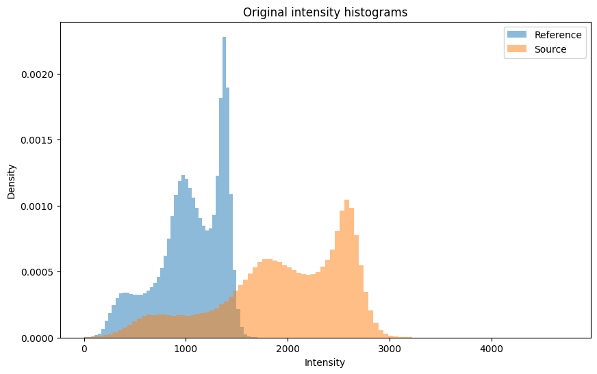
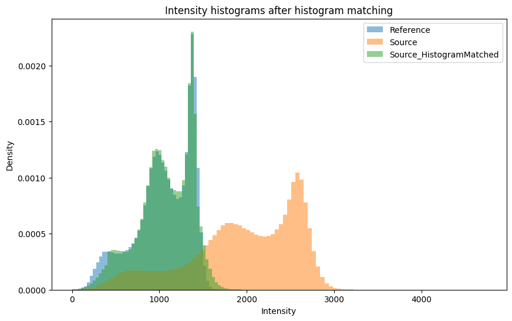
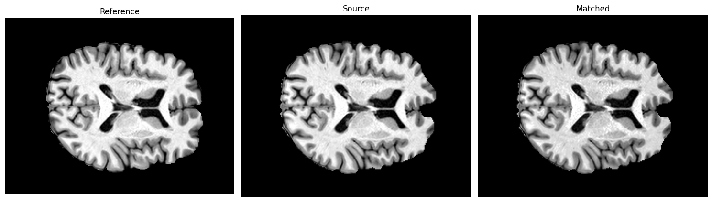
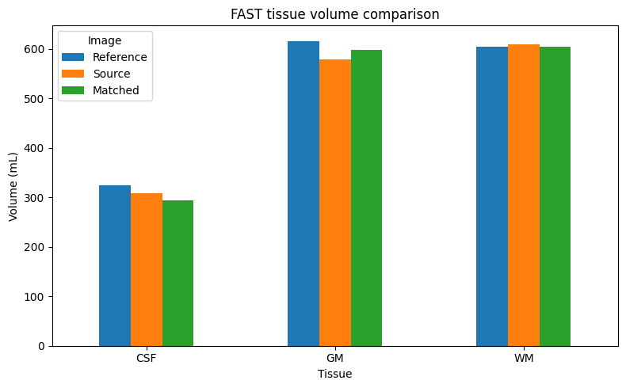
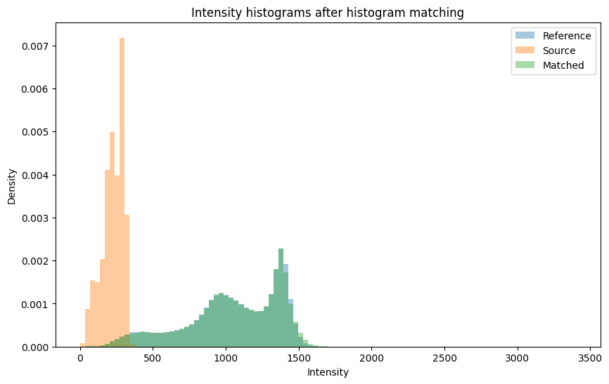
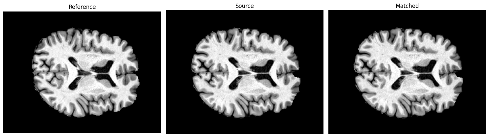

Image harmonisation using histogram matching
============================================

In this example, we will:

1. Load two MRI images acquired from different sessions or scanners.
2. Visualize their intensity histograms.
3. Apply histogram matching to align the intensity distribution of a
   source image to a reference image.
4. Visualize the histograms again to observe how the intensity
   distributions change after harmonisation.

Histogram matching is a simple global harmonisation method. It does not
modify anatomical structures or spatial information; instead, it adjusts
voxel intensity values so that the overall intensity distribution of the
source image more closely resembles that of the reference image.

Test data from ON-Harmony
-------------------------

The test data used in this notebook are stored in the
``histmatching_data`` folder.

The images are derived from the ON-Harmony dataset (`paper
here <https://www.nature.com/articles/s41597-025-04822-2>`__), which is
publicly available through
`OpenNeuro <https://openneuro.org/datasets/ds004712/versions/2.0.1>`__.

Histogram matching in ANTsPy
----------------------------

Before applying histogram matching:

- Bias-field correction should be performed first for e.g.,
  ``*_restore*`` images in FSL-FAST.
- Brain masking can improve robustness by excluding non-brain voxels.
- Typical workflow: Bias correction (FAST/N4) → optional brain masking →
  histogram matching

Important practical notes
~~~~~~~~~~~~~~~~~~~~~~~~~

This notebook is intended as an illustrative educational example of MRI
harmonisation workflows.

For simplicity, some preprocessing and segmentation outputs used in this
notebook are provided as precomputed examples for illustration and
methodological understanding. These example outputs have not been
specifically optimised or quality-controlled for downstream analysis.

In real neuroimaging studies, the following steps are strongly
recommended: - Visual quality control of raw and processed images -
Inspection of brain extraction accuracy - Verification of tissue
segmentation quality - Careful assessment of harmonisation effects on
downstream analyses - Validation across scanners, sites, and participant
groups

Histogram matching can improve consistency of image intensity
distributions, but it does not guarantee biologically accurate or
unbiased downstream measurements.

.. code:: ipython3

    # install packages if not done already
    %pip install antspyx nibabel

Step 1: Inspect the original images
-----------------------------------

Before matching, we first look at the intensity distributions of the
reference and source images. We remove background voxels so the
histograms focus on brain tissue rather than air.

.. code:: ipython3

    # Imports packages
    
    import os
    import numpy as np
    import ants 
    import matplotlib.pyplot as plt
    import nibabel as nib
    import pandas as pd
    from pathlib import Path
    
    repo_root = Path.cwd().parent.parent
    ref_file  = repo_root / "data" / "data_block4" / "histmatching_data" / "sub-03286" / "ses-OXF1PRI001" / "brain_restore.nii.gz"
    src_file  = repo_root / "data" / "data_block4" / "histmatching_data" / "sub-03286" / "ses-OXF2PRI001" / "brain_restore.nii.gz"
    
    
    reference_img = ants.image_read(str(ref_file))
    source_img    = ants.image_read(str(src_file))
    
    # Plot original histograms
    
    ref_np = reference_img.numpy()
    src_np = source_img.numpy()
    
    ref_vals = ref_np[ref_np > 0]
    src_vals = src_np[src_np > 0]
    
    plt.figure(figsize=(10, 6))
    
    plt.hist(ref_vals, bins=100, density=True, alpha=0.5, label="Reference")
    plt.hist(src_vals, bins=100, density=True, alpha=0.5, label="Source")
    
    plt.xlabel("Intensity")
    plt.ylabel("Density")
    plt.title("Original intensity histograms")
    plt.legend()
    plt.show()

Step 2: Apply histogram matching
--------------------------------

Histogram matching adjusts the source image so that its intensity
distribution becomes more similar to the reference image. This is a
simple example of harmonisation across scans or sessions.

.. code:: ipython3

    # Apply histogram matching
    matched_img = ants.histogram_match_image(source_img, reference_img)
    
    # Specify output image name with path
    output_img  = repo_root / "data" / "data_block4" / "histmatching_data" / "sub-03286" / "ses-OXF2PRI001" / "brain_restore_harmonisedToRef.nii.gz"
    
    ants.image_write(
        matched_img,
        str(output_img)
    )

Step 3: Compare histograms after matching
-----------------------------------------

Now we plot the histogram of the matched image alongside the original
reference and source images. If matching worked well, the matched
histogram should look more similar to the reference histogram.

.. code:: ipython3

    # Plot histogram after matching
    
    match_np = matched_img.numpy()
    match_vals = match_np[match_np > 0]
    
    plt.figure(figsize=(10, 6))
    
    plt.hist(ref_vals, bins=100, density=True, alpha=0.5, label="Reference")
    plt.hist(src_vals, bins=100, density=True, alpha=0.5, label="Source")
    plt.hist(match_vals, bins=100, density=True, alpha=0.5, label="Source_HistogramMatched")
    
    plt.xlabel("Intensity")
    plt.ylabel("Density")
    plt.title("Intensity histograms after histogram matching")
    plt.legend()
    plt.show()

Optional: Visual inspection of the images
-----------------------------------------

Histogram matching changes intensities, so it is also useful to inspect
images before and after matching.

Important visualization note
~~~~~~~~~~~~~~~~~~~~~~~~~~~~

Image appearance can be strongly influenced by display settings such as
intensity windowing and contrast scaling.

For fair visual comparison in this notebook, all images are displayed
using a common intensity range. However, visualization within Jupyter
notebooks is still simplified compared to dedicated neuroimaging
viewers.

For detailed inspection and quality control, it is strongly recommended
to use dedicated neuroimaging software such as:

- `FSLeyes <https://fsl.fmrib.ox.ac.uk/fsl/docs/utilities/fsleyes.html>`__
- `MRICroGL <https://www.nitrc.org/projects/mricrogl/>`__
- `ITK-SNAP <https://www.itksnap.org/pmwiki/pmwiki.php>`__
- `Freeview <https://surfer.nmr.mgh.harvard.edu/fswiki/FreeviewGuide/FreeviewIntroduction>`__
- or any other preferred

These tools provide interactive control over intensity scaling,
orientation, overlays, and anatomical navigation, which are important
for accurate interpretation and quality assessment.

.. code:: ipython3

    # Slice view: use each image's own middle slice
    ref_mid = ref_np.shape[2] // 2
    src_mid = src_np.shape[2] // 2
    match_mid = match_np.shape[2] // 2
    
    # Separate display ranges for each image
    ref_vmin, ref_vmax = np.percentile(ref_np[ref_np > 0], [2, 98])
    src_vmin, src_vmax = np.percentile(src_np[src_np > 0], [2, 98])
    match_vmin, match_vmax = np.percentile(match_np[match_np > 0], [2, 98])
    
    fig, axes = plt.subplots(1, 3, figsize=(15, 5))
    
    axes[0].imshow(ref_np[:, :, ref_mid], cmap="gray", vmin=ref_vmin, vmax=ref_vmax)
    axes[0].set_title("Reference")
    axes[0].axis("off")
    
    axes[1].imshow(src_np[:, :, src_mid], cmap="gray", vmin=src_vmin, vmax=src_vmax)
    axes[1].set_title("Source")
    axes[1].axis("off")
    
    axes[2].imshow(match_np[:, :, match_mid], cmap="gray", vmin=match_vmin, vmax=match_vmax)
    axes[2].set_title("Matched")
    axes[2].axis("off")
    
    plt.tight_layout()
    plt.show()

Compare downstream tissue volume estimates
------------------------------------------

Here we use precomputed
`FSL-FAST <https://fsl.fmrib.ox.ac.uk/fsl/docs/structural/fast.html>`__
tissue probability maps to estimate tissue volumes. You can find these
at this location:
``<repo_root>/data/data_block4/histmatching_data/sub-03286``.

FSL-FAST outputs partial-volume estimates for each tissue class. By
summing the partial-volume values and multiplying by voxel volume, we
obtain an approximate tissue volume.

This comparison is intended as an illustrative example of how histogram
matching can affect downstream quantitative measures.

.. code:: ipython3

    # This function will calculate the volumes for FAST
    
    def tissue_volume_from_pve(pve_path):
        """
        Estimate tissue volume from a FAST partial-volume estimate image.
        
        Parameters
        ----------
        pve_path : str
            Path to a FAST partial-volume estimate NIfTI file.
            
        Returns
        -------
        volume_ml : float
            Estimated tissue volume in mL.
        voxel_volume_mm3 : float
            Volume of one voxel in mm^3.
        shape : tuple
            Image shape.
        """
        img = nib.load(pve_path)
        data = img.get_fdata()
    
        # Voxel volume in mm^3
        voxel_volume_mm3 = np.prod(img.header.get_zooms()[:3])
    
        # FAST PVE values are fractional tissue volumes, so sum them
        volume_mm3 = np.sum(data) * voxel_volume_mm3
        volume_ml = volume_mm3 / 1000.0
    
        return volume_ml, voxel_volume_mm3, data.shape

.. code:: ipython3

    repo_root    = Path.cwd().parent.parent
    ref_dir      = repo_root / "data" / "data_block4" / "histmatching_data" / "sub-03286" / "ses-OXF1PRI001" 
    src_dir      = repo_root / "data" / "data_block4" / "histmatching_data" / "sub-03286" / "ses-OXF2PRI001" 
    matched_dir  = repo_root / "data" / "data_block4" / "histmatching_data" / "sub-03286" / "ses-OXF2PRI001" / "prebaked_fast_harmonised"
    
    # Example file layout
    reference_dir = str(ref_dir)
    source_dir    = str(src_dir)
    matched_dir   = str(matched_dir) 
    
    # FAST tissue classes
    # pve_0 = CSF
    # pve_1 = GM
    # pve_2 = WM
    
    paths = {
        "Reference_CSF": os.path.join(reference_dir, "brain_pve_0.nii.gz"),
        "Reference_GM":  os.path.join(reference_dir, "brain_pve_1.nii.gz"),
        "Reference_WM":  os.path.join(reference_dir, "brain_pve_2.nii.gz"),
    
        "Source_CSF": os.path.join(source_dir, "brain_pve_0.nii.gz"),
        "Source_GM":  os.path.join(source_dir, "brain_pve_1.nii.gz"),
        "Source_WM":  os.path.join(source_dir, "brain_pve_2.nii.gz"),
    
        "Matched_CSF": os.path.join(matched_dir, "src_image_harmonised_pve_0.nii.gz"),
        "Matched_GM":  os.path.join(matched_dir, "src_image_harmonised_pve_1.nii.gz"),
        "Matched_WM":  os.path.join(matched_dir, "src_image_harmonised_pve_2.nii.gz"),
    }
    
    rows = []
    for label, path in paths.items():
        vol_ml, voxel_vol_mm3, shape = tissue_volume_from_pve(path)
        image_type, tissue = label.split("_")
        rows.append({
            "Image": image_type,
            "Tissue": tissue,
            "Volume_mL": vol_ml,
            "VoxelVolume_mm3": voxel_vol_mm3,
            "Shape": shape
        })
    df = pd.DataFrame(rows)
    table = df.pivot(index="Tissue", columns="Image", values="Volume_mL")
    table = table[["Reference", "Source", "Matched"]]
    print(table)
    ax = table.plot(kind="bar", figsize=(8, 5))
    ax.set_ylabel("Volume (mL)")
    ax.set_title("FAST tissue volume comparison")
    ax.legend(title="Image")
    plt.xticks(rotation=0)
    plt.tight_layout()
    plt.show()

.. parsed-literal::

    Image    Reference      Source     Matched
    Tissue                                    
    CSF     324.223583  308.495414  294.923226
    GM      616.658704  579.627509  598.164962
    WM      605.131713  609.327077  604.361812

Interpretation
~~~~~~~~~~~~~~

If histogram matching improves intensity consistency, the estimated
tissue volumes for the matched image may move closer to those of the
reference image. This does not imply that the underlying anatomy
changed. Rather, the intensity representation became more similar, which
can influence intensity-based downstream processing.

Exercise: does histogram matching help?
---------------------------------------

Choose one pair of repeated scans from the same participant (you can
download from
`here <https://openneuro.org/datasets/ds004712/versions/2.0.1>`__).

1. Compare the original histograms.
2. Apply histogram matching.
3. Compare the histograms again.
4. Decide whether the matched image looks closer to the reference image.

Discussion: - Does histogram matching work better for repeated scans
from the same scanner? - Does it still help when the scans come from
different scanners or vendors? - Where does it start to fail?

Solution
~~~~~~~~

We downloaded data from one of the participants from this
`link <(https://openneuro.org/datasets/ds004712/versions/2.0.1)>`__. You
can check the solutions of this notebook
`here <https://github.com/N-Nieto/OHBM2026_Educational_course_harmonization/tree/main/solutions/block04/B4_N2_histmatching_exercise>`__.

- ``Source Image``: *sub-03286_ses-OXF3TRI001_T1w.nii.gz* (Siemens Trio)
- ``Reference Image``: *sub-03286_ses-OXF1PRI001_T1w.nii.gz* (Siemens
  Prisma)
- Perform brain extraction (FSL-BET)
- Perform FAST segmentation and store bias corrected output (FSL-FAST);
  alternatively you can use ANTs tools for bias correction as well
- Use ``_restore.nii.gz`` for histogram matching

See code below which will compare the original histograms, apply
histogram matching.

Discussion: Histogram Matching Across Scanner Vendors
~~~~~~~~~~~~~~~~~~~~~~~~~~~~~~~~~~~~~~~~~~~~~~~~~~~~~

Histogram matching can be an effective intensity normalization technique
when comparing scans acquired on the same scanner or scanners from the
same manufacturer (*As seen in example in the original workbook when we
used repeat scans from same scanner and model e.g., Siemens Prisma; as
well as example below when we used repeat scans from same scanner but
different model e.g., Siemens Prisma and Siemens Trio*). In these
situations, the underlying intensity distributions are often similar,
and histogram matching can improve visual consistency between images.
However, when comparing images acquired across different scanner vendors
(e.g., Siemens, GE, Philips), the intensity distributions may differ
substantially due to variations in hardware, reconstruction algorithms,
coil configurations, and acquisition protocols. It is important to
recognise that MRI intensities do not have a fixed physical scale.
Histogram matching therefore attempts to force one intensity
distribution to resemble another, even when the relationship between
tissue intensities differs across scanners. As a result, histogram
matching should be viewed as a simple intensity normalisation method
rather than a comprehensive harmonisation strategy.

**Key takeaway:** Histogram matching often works well for repeated scans
or images acquired on similar scanner platforms, but its performance may
degrade when applied across different vendors or acquisition protocols.
More advanced harmonisation approaches (see below) are typically more
appropriate for multi-site and multi-vendor studies.

.. code:: ipython3

    import ants
    import numpy as np
    import matplotlib.pyplot as plt
    from pathlib import Path
    
    repo_root = Path.cwd().parent.parent
    
    ref_file = repo_root / "solutions" / "block04" / "B4_N2_histmatching_exercise" / "sub-03286" / "ses-OXF1PRI001" / "brain_restore.nii.gz"
    src_file = repo_root / "solutions" / "block04" / "B4_N2_histmatching_exercise" / "sub-03286" / "ses-OXF3TRI001" / "brain_restore.nii.gz"
    
    reference_img = ants.image_read(str(ref_file))
    source_img = ants.image_read(str(src_file))
    
    ref_np = reference_img.numpy()
    src_np = source_img.numpy()
    
    ref_vals = ref_np[ref_np > 0]
    src_vals = src_np[src_np > 0]
    
    # Histogram match
    matched_img = ants.histogram_match_image(source_img, reference_img)
    
    output_img = repo_root / "solutions" / "block04" / "B4_N2_histmatching_exercise" / "sub-03286" / "ses-OXF3TRI001" / "brain_restore_harmonisedToRef.nii.gz"
    ants.image_write(matched_img, str(output_img))
    
    match_np = matched_img.numpy()
    match_vals = match_np[match_np > 0]
    
    # Use shared bin edges for a fair comparison
    all_vals = np.concatenate([ref_vals, src_vals, match_vals])
    bin_edges = np.histogram_bin_edges(all_vals, bins=100)
    
    plt.figure(figsize=(10, 6))
    plt.hist(ref_vals, bins=bin_edges, density=True, alpha=0.4, label="Reference")
    plt.hist(src_vals, bins=bin_edges, density=True, alpha=0.4, label="Source")
    plt.hist(match_vals, bins=bin_edges, density=True, alpha=0.4, label="Matched")
    plt.xlabel("Intensity")
    plt.ylabel("Density")
    plt.title("Intensity histograms after histogram matching")
    plt.legend()
    plt.show()
    
    # Slice view: use each image's own middle slice 
    ref_mid = ref_np.shape[2] // 2
    src_mid = src_np.shape[2] // 2
    match_mid = match_np.shape[2] // 2
    
    # Separate display ranges for each image
    ref_vmin, ref_vmax = np.percentile(ref_np[ref_np > 0], [2, 98])
    src_vmin, src_vmax = np.percentile(src_np[src_np > 0], [2, 98])
    match_vmin, match_vmax = np.percentile(match_np[match_np > 0], [2, 98])
    
    fig, axes = plt.subplots(1, 3, figsize=(15, 5))
    
    axes[0].imshow(ref_np[:, :, ref_mid], cmap="gray", vmin=ref_vmin, vmax=ref_vmax)
    axes[0].set_title("Reference")
    axes[0].axis("off")
    
    axes[1].imshow(src_np[:, :, src_mid], cmap="gray", vmin=src_vmin, vmax=src_vmax)
    axes[1].set_title("Source")
    axes[1].axis("off")
    
    axes[2].imshow(match_np[:, :, match_mid], cmap="gray", vmin=match_vmin, vmax=match_vmax)
    axes[2].set_title("Matched")
    axes[2].axis("off")
    
    plt.tight_layout()
    plt.show()

## Advanced Image-Level Harmonisation Approaches
------------------------------------------------

A growing number of methods aim to address scanner and acquisition
variability directly at the image level, often using deep learning,
synthesis, segmentation, or domain-adaptation frameworks. These
approaches can substantially improve robustness across heterogeneous
datasets, particularly in multi-site neuroimaging studies.

Some widely used and emerging tools include:

- **SynthSR** A deep-learning framework for generating high-resolution
  synthetic MRI volumes with improved contrast consistency across
  acquisitions and resolutions. More details
  `here <https://surfer.nmr.mgh.harvard.edu/fswiki/SynthSR>`__.

- **SynthSeg** A contrast-agnostic segmentation framework capable of
  robust anatomical segmentation across varying scanners, contrasts, and
  acquisition protocols. More details
  `here <https://surfer.nmr.mgh.harvard.edu/fswiki/SynthSeg>`__.

- **Recon-all-Clinical** An optimised FreeSurfer-based pipeline designed
  for clinical-quality scans, incorporating robust preprocessing and
  segmentation strategies for heterogeneous datasets. More details
  `here <https://surfer.nmr.mgh.harvard.edu/fswiki/recon-all-clinical>`__.

- **HaCa3** A harmonisation-oriented framework designed to improve
  cross-site consistency while preserving biologically meaningful image
  characteristics. More details
  `here <https://doi.org/10.1016/j.compmedimag.2023.102285>`__.

- **CALAMITI** A deep-learning-based MRI harmonisation framework
  targeting scanner-related intensity variability. More details
  `here <https://iacl.ece.jhu.edu/index.php?title=CALAMITI>`__.

- **DeepHarmony** A supervised image harmonisation approach that learns
  scanner mappings using paired acquisitions. More details
  `here <https://doi.org/10.1016/j.mri.2019.05.041>`__.

- **MISPEL** A multi-scanner image harmonisation framework using
  disentangled representation learning. More details
  `here <https://doi.org/10.1016/j.media.2023.102926>`__.

- **CycleGAN / GAN-based harmonisation approaches** Unpaired image
  translation methods frequently used for cross-scanner or cross-domain
  MRI harmonisation. More details
  `here <https://github.com/Iceberg6618/CycleGAN-Harmonization>`__.

- **RAVEL / WhiteStripe / Nyúl standardisation** Classical
  intensity-standardisation methods commonly used to reduce
  scanner-related intensity variation prior to downstream analysis. More
  details `here <https://doi.org/10.1016/j.neuroimage.2021.118703>`__.

Why These Methods Are Not Included in This Course
-------------------------------------------------

Although highly valuable in research settings, these advanced
image-level harmonisation methods are intentionally not included as
executable components of this educational course.

This is primarily because:

- installation and environment setup can become highly
  platform-dependent,
- implementations often require complex software dependencies,
- GPU acceleration may be necessary for practical runtimes,
- preprocessing requirements can differ substantially across methods,
- computational demands may exceed lightweight educational environments,
- some pipelines require substantial storage and memory resources,
- reproducibility may vary across operating systems and software
  versions.

In addition, many image-level harmonisation frameworks require careful
dataset-specific optimisation, quality control, and validation before
research deployment.

For these reasons, this course focuses on lightweight, interpretable,
and reproducible educational examples that illustrate the core
methodological concepts without imposing substantial computational or
infrastructure requirements.

